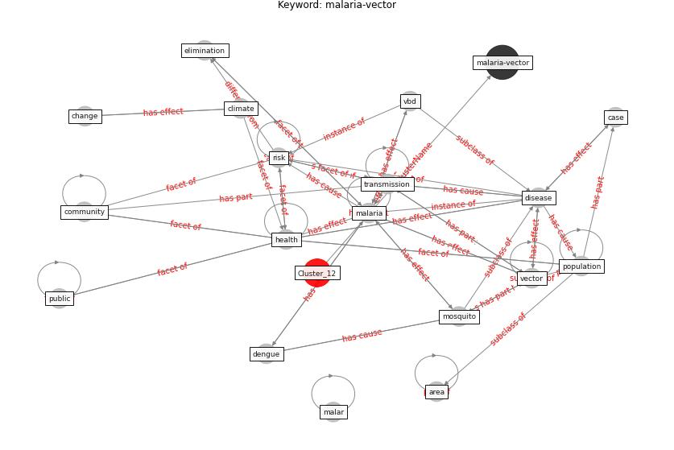

# Cluster: __wastewater-sars__ (cluster12)
## Keywords

* [wastewater](keyword_wastewater), [sars](keyword_sars), [sample](keyword_sample), [pcr](keyword_pcr), [sewage](keyword_sewage), [primer](keyword_primer), [biomarker](keyword_biomarker), [detection](keyword_detection), [surveillance](keyword_surveillance), [rna](keyword_rna), [virus](keyword_virus), [assay](keyword_assay), [viral](keyword_viral), [qpcr](keyword_qpcr), [titer](keyword_titer), [gene](keyword_gene), [population](keyword_population), [clinical](keyword_clinical), [water](keyword_water), [rst](keyword_rst)

## Concepts

 

## Articles
* Wastewater-Based Epidemiology to monitor COVID-19
outbreak: Present and future diagnostic methods to be in
your radar ([barcelo_wastewater-based_2020](article_barcelo_wastewater-based_2020))
* SARS-CoV-2 Titers in Wastewater Are Higher
than Expected from Clinically Confirmed Cases ([wu_sars-cov-2_2020](article_wu_sars-cov-2_2020))
* SARS-CoV-2 in wastewater: potential health risk, but
also data source ([lodder_sars-cov-2_2020](article_lodder_sars-cov-2_2020))
* Disinfection technology of hospital wastes and wastewater:
Suggestions for disinfection strategy during coronavirus
Disease 2019 (COVID-19) pandemic in China ([wang_disinfection_2020](article_wang_disinfection_2020))
* First detection of SARS-CoV-2 in untreated wastewaters
in Italy ([la_rosa_first_2020](article_la_rosa_first_2020))
* When the fourth water and digital revolution encountered
COVID-19 ([poch_when_2020](article_poch_when_2020))
* Future perspectives of wastewater-based epidemiology:
Monitoring infectious disease spread and resistance to
the community level ([sims_future_2020](article_sims_future_2020))
* Computational analysis of SARS-CoV-2/COVID-19
surveillance by wastewater-based epidemiology locally and
globally: Feasibility, economy, opportunities and
challenges ([hart_computational_2020](article_hart_computational_2020))
