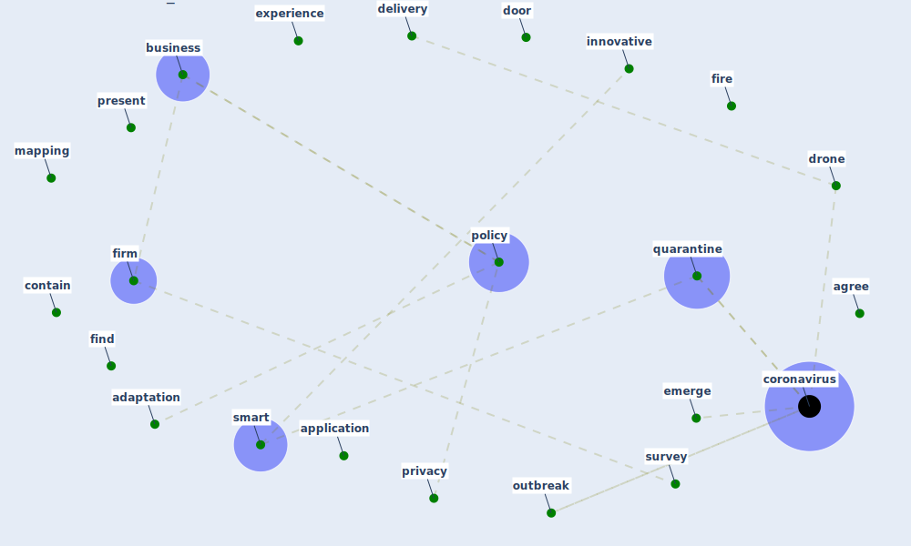

# Cluster: __surveying-drone__ (Cluster_13)

## Keywords

 * [ad](keyword_ad), [adapt](keyword_adapt), [adaptation](keyword_adaptation), [agree](keyword_agree), [application](keyword_application), [big](keyword_big), [business](keyword_business), [click](keyword_click), [contain](keyword_contain), [coron](keyword_coron), [coronavirus](keyword_coronavirus), [delivery](keyword_delivery), [door](keyword_door), [drone](keyword_drone), [drones](keyword_drones), [emerge](keyword_emerge), [enforce](keyword_enforce), [exist](keyword_exist), [experience](keyword_experience), [fin](keyword_fin), [final](keyword_final), [finalize](keyword_finalize), [finally](keyword_finally), [find](keyword_find), [fink](keyword_fink), [fiorillo](keyword_fiorillo), [fiorito](keyword_fiorito), [fire](keyword_fire), [firm](keyword_firm), [firmly](keyword_firmly), [innovative](keyword_innovative), [kg](keyword_kg), [lift](keyword_lift), [mapping](keyword_mapping), [maximum](keyword_maximum), [outbreak](keyword_outbreak), [per](keyword_per), [policy](keyword_policy), [present](keyword_present), [privacy](keyword_privacy), [quarantine](keyword_quarantine), [relevant](keyword_relevant), [scmp](keyword_scmp), [shenzhen](keyword_shenzhen), [show](keyword_show), [smart](keyword_smart), [survey](keyword_survey), [tailor](keyword_tailor), [task](keyword_task), [uav](keyword_uav)

## Concepts

 

# Linked articles

* China adapts survey drones to enforce world’s largest quarantine - [LINK](article_liu_china_2020)
