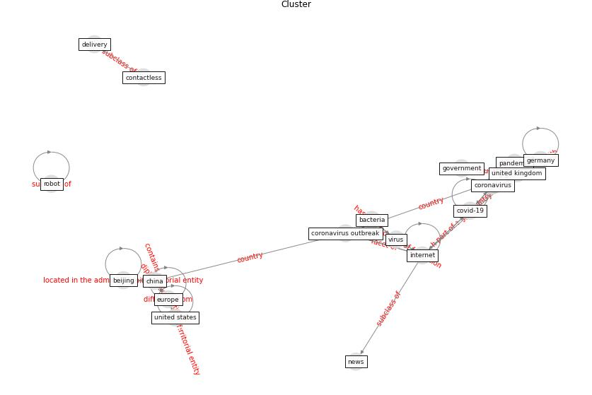

# Cluster: __blockchain-technology__ (cluster13)
## Keywords

* [blockchain](keyword_blockchain), [technology](keyword_technology), [iot](keyword_iot), [pandemic](keyword_pandemic), [datum](keyword_datum), [patient](keyword_patient), [medical](keyword_medical), [application](keyword_application), [network](keyword_network), [health](keyword_health), [smart](keyword_smart), [healthcare](keyword_healthcare), [device](keyword_device), [base](keyword_base), [remote](keyword_remote), [virtual](keyword_virtual), [digital](keyword_digital), [system](keyword_system), [vr](keyword_vr), [contact](keyword_contact)

## Concepts

 

## Articles
* Blockchain technology and its applications to combat
COVID-19 pandemic ([sharma_blockchain_2022](article_sharma_blockchain_2022))
* Significant applications of virtual reality for COVID-19
pandemic ([singh_significant_2020](article_singh_significant_2020))
* Contributions of Smart City Solutions and
Technologies to Resilience against the COVID-19
Pandemic: A Literature Review ([sharifi_contributions_2021](article_sharifi_contributions_2021))
* Mobile Technology Solution for COVID-19:
Surveillance and Prevention ([raza_mobile_2021](article_raza_mobile_2021))
* Emerging Technologies to Combat the COVID-19
Pandemic ([vaishya_emerging_2020](article_vaishya_emerging_2020))
* Internet of things (IoT) applications to fight against
COVID-19 pandemic ([singh_internet_2020](article_singh_internet_2020))
* A Comprehensive Review of the COVID-19 Pandemic
and the Role of IoT, Drones, AI, Blockchain, and
5G in Managing its Impact ([chamola_comprehensive_2020](article_chamola_comprehensive_2020))
* Leveraging Digital Transformation Technologies to
Tackle COVID-19: Proposing a Privacy-First
Holistic Framework ([arpaci_leveraging_2021](article_arpaci_leveraging_2021))
* Design COVID-19 Ontology: A Healthcare and
Safety Perspective ([aloulou_design_2022](article_aloulou_design_2022))
* Digital Twin of COVID-19 Mass Vaccination
Centers ([pilati_digital_2021](article_pilati_digital_2021))
* Health Information Exchange with Blockchain amid
Covid-19-like Pandemics ([christodoulou_health_2020](article_christodoulou_health_2020))
* Future (post-COVID) digital, smart and sustainable
cities in the wake of 6G: Digital twins, immersive
realities and new urban economies ([allam_future_2021](article_allam_future_2021))
* How the 5G Enabled the COVID-19 Pandemic
Prevention and Control: Materiality, Affordance,
and (De-)Spatialization ([li_how_2022](article_li_how_2022))
* The role of 5G for digital healthcare against COVID-19
pandemic: Opportunities and challenges ([siriwardhana_role_2021](article_siriwardhana_role_2021))
* Digital technology and COVID-19 ([ting_digital_2020](article_ting_digital_2020))
* Impact of COVID-19 on IoT Adoption in Healthcare,
Smart Homes, Smart Buildings, Smart Cities,
Transportation and Industrial IoT ([umair_impact_2021](article_umair_impact_2021))
* council_of_europe_2020_2020 ([council_of_europe_2020_2020](article_council_of_europe_2020_2020))
* Using Technology to Maintain the Education of
Residents During the COVID-19 Pandemic ([chick_using_2020](article_chick_using_2020))
* How Can Blockchain Help People in the Event of
Pandemics Such as the COVID-19? ([chang_how_2020](article_chang_how_2020))
