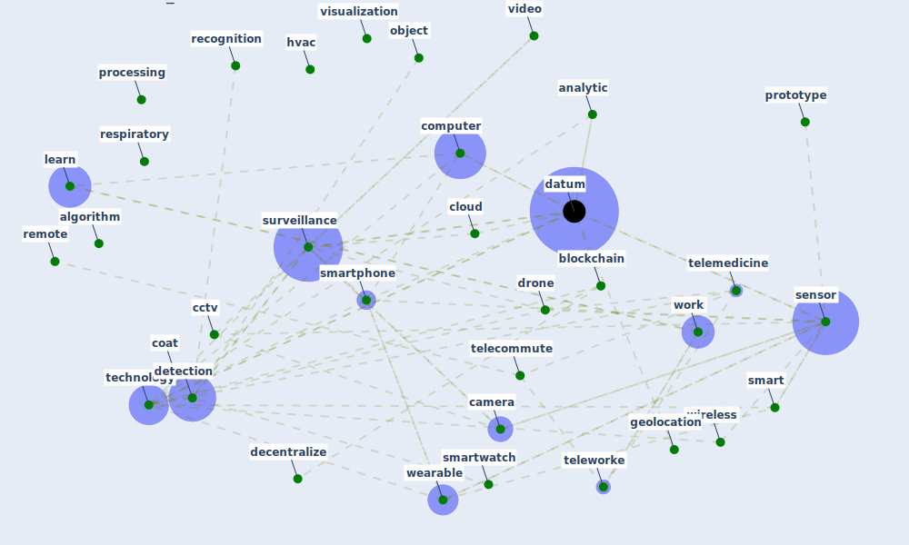

# Cluster: __processing-wireless__ (Cluster_14)

## Keywords

 * [algorithm](keyword_algorithm), [analytic](keyword_analytic), [big](keyword_big), [bim](keyword_bim), [biometric](keyword_biometric), [blockchain](keyword_blockchain), [bracelet](keyword_bracelet), [camera](keyword_camera), [cctv](keyword_cctv), [chatbot](keyword_chatbot), [cloud](keyword_cloud), [coat](keyword_coat), [computer](keyword_computer), [datum](keyword_datum), [decentralize](keyword_decentralize), [detection](keyword_detection), [drone](keyword_drone), [fabrication](keyword_fabrication), [face](keyword_face), [geo](keyword_geo), [geolocation](keyword_geolocation), [hvac](keyword_hvac), [industrialization](keyword_industrialization), [learn](keyword_learn), [mining](keyword_mining), [novelcoronavirus](keyword_novelcoronavirus), [object](keyword_object), [permission](keyword_permission), [predictive](keyword_predictive), [processing](keyword_processing), [prototype](keyword_prototype), [recognition](keyword_recognition), [remote](keyword_remote), [respiratory](keyword_respiratory), [sensor](keyword_sensor), [smart](keyword_smart), [smartphone](keyword_smartphone), [smartwatch](keyword_smartwatch), [surveillance](keyword_surveillance), [technology](keyword_technology), [tele](keyword_tele), [telecommute](keyword_telecommute), [telemedicine](keyword_telemedicine), [telework](keyword_telework), [teleworke](keyword_teleworke), [video](keyword_video), [visualization](keyword_visualization), [wearable](keyword_wearable), [wireless](keyword_wireless), [work](keyword_work)

## Concepts

 

# Linked articles

* A Platform for Citizen Cooperation during the COVID-19 Pandemic in RN, Brazil - [LINK](article_de_araujo_platform_2020)
* Assessing the health and hygiene performance of apartment buildings - [LINK](article_ho_assessing_2004)
*  - [LINK](article_huy-tran_design_2022)
