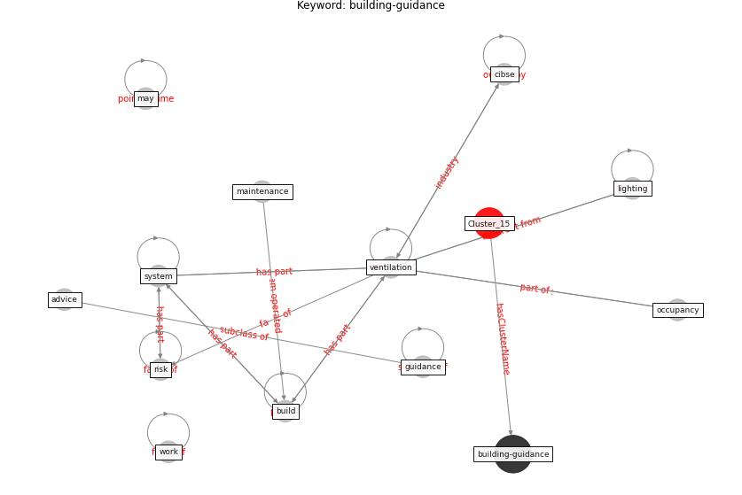

# Cluster: __uv-air__ (Cluster_15)

## Keywords

 * [aerosol](keyword_aerosol), [air](keyword_air), [airborne](keyword_airborne), [disinfection](keyword_disinfection), [germicidal](keyword_germicidal), [inactivate](keyword_inactivate), [inactivation](keyword_inactivation), [irradiation](keyword_irradiation), [light](keyword_light), [mhv](keyword_mhv), [microorganism](keyword_microorganism), [room](keyword_room), [system](keyword_system), [tb](keyword_tb), [tuberculosis](keyword_tuberculosis), [ultraviolet](keyword_ultraviolet), [upper](keyword_upper), [uv](keyword_uv), [uvgi](keyword_uvgi), [virus](keyword_virus)

## Concepts

 

# Linked articles

* Behind the Update: ASHRAE Handbook Chapters on UV-C to Include Updated Best Practices, Guidance - [LINK](article_ashrae_behind_2020)
* Efficacy of an Automated Multiple Emitter Whole-Room Ultraviolet-C Disinfection System Against Coronaviruses MHV and MERS-CoV - [LINK](article_bedell_efficacy_2016)
* Upper-room ultraviolet air disinfection might help to reduce COVID-19 transmission in buildings: a feasibility study - [LINK](article_beggs_upper-room_2020)
* Blueprint: Installing UV in ductwork - [LINK](bp_10)
* Far-UVC light (222 nm) efficiently and safely inactivates airborne human coronaviruses - [LINK](article_buonanno_far-uvc_2020)
* Upper-Room Ultraviolet Light and Negative Air Ionization to Prevent Tuberculosis Transmission - [LINK](article_escombe_upper-room_2009)
* Case Study: Using Germicidal UV-C to Mitigate COVID-19 - HVAC - [LINK](article_healthcare_facilities_today_case_2021)
* Applications of ultraviolet germicidal irradiation disinfection in health care facilities: Effective adjunct, but not stand-alone technology - [LINK](article_memarzadeh_applications_2010)
* Air Disinfection for Airborne Infection Control with a Focus on COVID‐19: Why Germicidal UV is Essential             † - [LINK](article_nardell_air_2021)
* Effect of Ultraviolet Germicidal Irradiation on Viral Aerosols - [LINK](article_walker_effect_2007)
