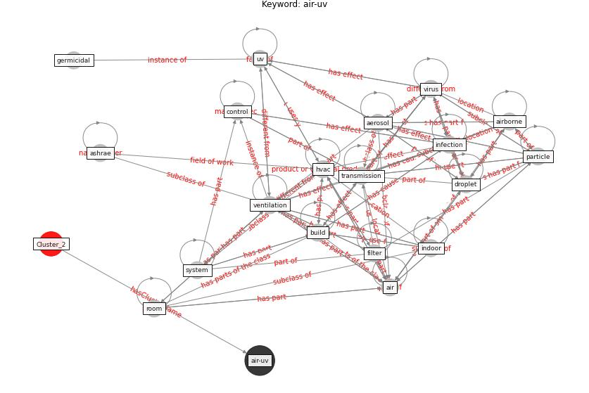

# Cluster: __construction-resilience__ (cluster2)
## Keywords

* [climate](keyword_climate.md), [change](keyword_change.md), [andre](keyword_andre.md), [building](keyword_building.md), [method](keyword_method.md), [type](keyword_type.md), [sociale](keyword_sociale.md), [animal](keyword_animal.md), [risk](keyword_risk.md), [disease](keyword_disease.md), [health](keyword_health.md), [valley](keyword_valley.md), [air](keyword_air.md), [harvard](keyword_harvard.md), [corona](keyword_corona.md), [pollution](keyword_pollution.md), [sarvari](keyword_sarvari.md), [coronavirus](keyword_coronavirus.md), [design](keyword_design.md), [fever](keyword_fever.md)

## Concepts

 

## Articles
* Revisiting the built environment: 10 potential development
changes and paradigm shifts due to COVID-19 ([cheshmehzangi_revisiting_2021](article_cheshmehzangi_revisiting_2021.md))
* nassereddine_propositions_2021 ([nassereddine_propositions_2021](article_nassereddine_propositions_2021.md))
