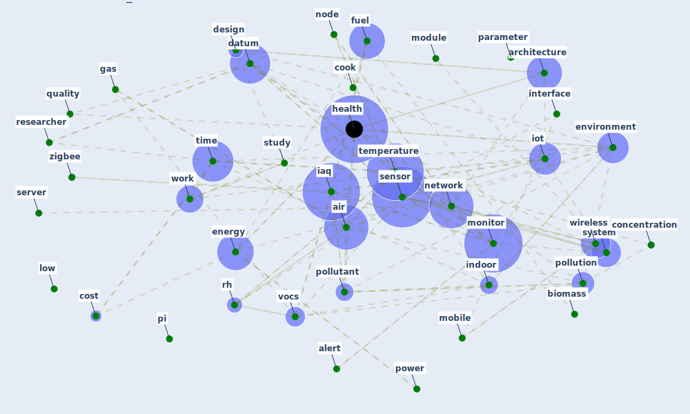

# Cluster: __iaq-system__ (Cluster_3)

## Keywords

 * [air](keyword_air), [alert](keyword_alert), [architecture](keyword_architecture), [base](keyword_base), [biomass](keyword_biomass), [concentration](keyword_concentration), [cook](keyword_cook), [cost](keyword_cost), [datum](keyword_datum), [design](keyword_design), [energy](keyword_energy), [environment](keyword_environment), [fuel](keyword_fuel), [gas](keyword_gas), [gaseous](keyword_gaseous), [health](keyword_health), [iaq](keyword_iaq), [indoor](keyword_indoor), [interface](keyword_interface), [iot](keyword_iot), [low](keyword_low), [mobile](keyword_mobile), [module](keyword_module), [monitor](keyword_monitor), [monitor](keyword_monitor), [network](keyword_network), [node](keyword_node), [parameter](keyword_parameter), [pi](keyword_pi), [pollutant](keyword_pollutant), [pollution](keyword_pollution), [power](keyword_power), [prediction](keyword_prediction), [quality](keyword_quality), [raspberry](keyword_raspberry), [real](keyword_real), [researcher](keyword_researcher), [reveal](keyword_reveal), [rh](keyword_rh), [saini](keyword_saini), [sensor](keyword_sensor), [server](keyword_server), [study](keyword_study), [system](keyword_system), [temperature](keyword_temperature), [time](keyword_time), [vocs](keyword_vocs), [wireless](keyword_wireless), [work](keyword_work), [zigbee](keyword_zigbee)

## Concepts

 

# Linked articles

* A comprehensive review on indoor air quality monitoring systems for enhanced public health - [LINK](article_saini_comprehensive_2020)
