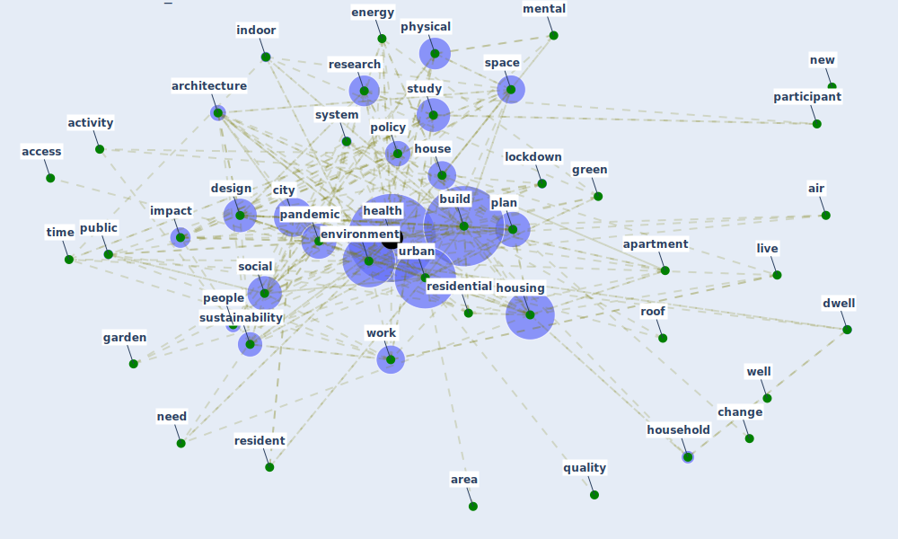

# Cluster: __space-housing__ (Cluster_4)

## Keywords

 * [access](keyword_access), [activity](keyword_activity), [air](keyword_air), [apartment](keyword_apartment), [architecture](keyword_architecture), [area](keyword_area), [build](keyword_build), [build](keyword_build), [change](keyword_change), [city](keyword_city), [design](keyword_design), [dwell](keyword_dwell), [energy](keyword_energy), [environment](keyword_environment), [garden](keyword_garden), [green](keyword_green), [health](keyword_health), [house](keyword_house), [household](keyword_household), [housing](keyword_housing), [impact](keyword_impact), [increase](keyword_increase), [indoor](keyword_indoor), [live](keyword_live), [lockdown](keyword_lockdown), [mental](keyword_mental), [need](keyword_need), [new](keyword_new), [pandemic](keyword_pandemic), [participant](keyword_participant), [people](keyword_people), [physical](keyword_physical), [plan](keyword_plan), [policy](keyword_policy), [public](keyword_public), [quality](keyword_quality), [research](keyword_research), [resident](keyword_resident), [residential](keyword_residential), [respondent](keyword_respondent), [roof](keyword_roof), [social](keyword_social), [space](keyword_space), [study](keyword_study), [sustainability](keyword_sustainability), [system](keyword_system), [time](keyword_time), [urban](keyword_urban), [well](keyword_well), [work](keyword_work)

## Concepts

 

# Linked articles

* COVID-19 Pandemic: Rethinking Strategies for Resilient Urban Design, Perceptions, and Planning - [LINK](article_afrin_covid-19_2021)
* Urban form: Realising the value of green space: a planners’ perspective on the COVID-19 pandemic - [LINK](article_ahmadpoor_urban_2021)
* COVID-19 Lockdown: Housing Built Environment’s Effects on Mental Health - [LINK](article_amerio_covid-19_2020)
* Towards Resilient Residential Buildings and Neighborhoods in Light of COVID-19 Pandemic—The Scenario of Podgorica, Montenegro - [LINK](article_bojovic_towards_2022)
* A Mixed Approach on Resilience of Spanish Dwellings and Households during COVID-19 Lockdown - [LINK](article_cuerdo-vilches_mixed_2020)
*  - [LINK](article_dalessandro_covid-19_2020)
* Prophylactic Architecture: Formulating the Concept of Pandemic-Resilient Homes - [LINK](article_elrayies_prophylactic_2022)
* Green infrastructure through the lens of “One Health”: A systematic review and integrative framework uncovering synergies and trade-offs between mental health and wildlife support in cities - [LINK](article_felappi_green_2020)
* Dangerous liaisons? Applying the social harm perspective to the social inequality, housing and health trifecta during the Covid-19 pandemic - [LINK](article_gurney_dangerous_2021)
* Houses amid COVID-19: Environmental challenges and design adaptation - [LINK](article_hizra_houses_2021)
* The Impact of COVID-19 on Public Space: A Review of the Emerging Questions - [LINK](article_honey-roses_impact_2020)
* COVID-19 and Green Housing: A Review of Relevant Literature - [LINK](article_kaklauskas_covid-19_2021)
* The Role of Architecture and Urbanism in Preventing Pandemics - [LINK](article_kumar_role_2021)
* Impact of Covid-19 on the built environment - [LINK](article_mahima_impact_2022)
* The role of green roofs in post COVID-19 confinement: An analysis of willingness to pay - [LINK](article_manso_role_2021)
* Antivirus-built environment: Lessons learned from Covid-19 pandemic - [LINK](article_megahed_antivirus-built_2020)
* The impact of the COVID-19 pandemic on the importance of urban green spaces to the public - [LINK](article_noszczyk_impact_2022)
* How our homes impact our health: using a COVID-19 informed approach to examine urban apartment housing - [LINK](article_peters_how_2020)
* Public housing and COVID-19: contestation, challenge and change - [LINK](article_power_public_2020)
* Urban Green Infrastructure and Green Open Spaces: An Issue of Social Fairness in Times of COVID-19 Crisis - [LINK](article_reinwald_urban_2021)
* Coronavirus questions that will not go away: interrogating urban and socio-spatial implications of COVID-19 measures - [LINK](article_salama_coronavirus_2020)
* Association between indoor-outdoor green features and psychological health during the COVID-19 lockdown in Italy: A cross-sectional nationwide study - [LINK](article_spano_association_2021)
* Designing for COVID-2x: Reflecting on Future-Proofing Human Habitation for the Inevitable Next Pandemic - [LINK](article_spennemann_designing_2022)
* RESIDENTIAL ARCHITECTURE IN A POST-PANDEMIC WORLD: IMPLICATIONS OF COVID-19 FOR NEW CONSTRUCTION AND FOR ADAPTING HERITAGE BUILDINGS - [LINK](article_spennemann_residential_2021)
* How is COVID-19 Experience Transforming Sustainability Requirements of Residential Buildings? A Review - [LINK](article_tokazhanov_how_2020)
* Effects of the COVID-19 pandemic on the use and perceptions of urban green space: An international exploratory study - [LINK](article_ugolini_effects_2020)
