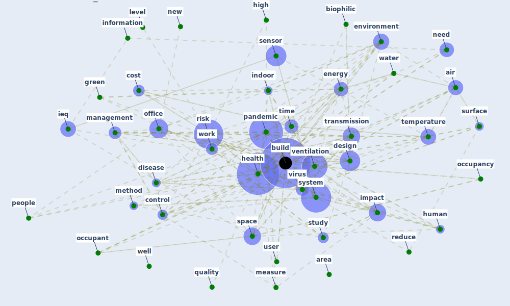

# Cluster: __building-design__ (Cluster_5)

## Keywords

 * [access](keyword_access), [air](keyword_air), [area](keyword_area), [biophilic](keyword_biophilic), [build](keyword_build), [build](keyword_build), [change](keyword_change), [control](keyword_control), [cost](keyword_cost), [design](keyword_design), [disease](keyword_disease), [energy](keyword_energy), [environment](keyword_environment), [green](keyword_green), [health](keyword_health), [high](keyword_high), [human](keyword_human), [ieq](keyword_ieq), [impact](keyword_impact), [include](keyword_include), [indoor](keyword_indoor), [information](keyword_information), [level](keyword_level), [management](keyword_management), [measure](keyword_measure), [method](keyword_method), [need](keyword_need), [new](keyword_new), [occupancy](keyword_occupancy), [occupant](keyword_occupant), [office](keyword_office), [pandemic](keyword_pandemic), [people](keyword_people), [quality](keyword_quality), [reduce](keyword_reduce), [risk](keyword_risk), [sensor](keyword_sensor), [space](keyword_space), [study](keyword_study), [surface](keyword_surface), [system](keyword_system), [temperature](keyword_temperature), [time](keyword_time), [transmission](keyword_transmission), [user](keyword_user), [ventilation](keyword_ventilation), [virus](keyword_virus), [water](keyword_water), [well](keyword_well), [work](keyword_work)

## Concepts

 

# Linked articles

* Occupants’ behavior and activity patterns influencing the energy consumption in the Kuwaiti residences - [LINK](article_al-mumin_occupants_2003)
* Adaptive Design of the Built Environment to Mitigate the Transmission Risk of COVID-19 - [LINK](article_ara_dilshad_shangi_adaptive_2020)
* Occupant health in buildings: Impact of the COVID-19 pandemic on the opinions of building professionals and implications on research - [LINK](article_awada_occupant_2022)
* Ten questions concerning occupant health in buildings during normal operations and extreme events including the COVID-19 pandemic - [LINK](article_awada_ten_2021)
* Blueprint: Rotational Shift System - [LINK](bp_0)
* Blueprint: Building Adaptation during a pandemic - [LINK](bp_14)
* Blueprint: Air Cleaning Plants - [LINK](bp_15)
* Blueprint: Good hand hygiene practice - [LINK](bp_16)
* Blueprint: Reducing contact points - [LINK](bp_17)
* Blueprint: Animal vectors control - [LINK](bp_22)
* Blueprint: Tracking and enforcing use of Personal Protective Equipment - [LINK](bp_23)
* Blueprint: Indoor Environmental Quality (IEQ) monitoring system - [LINK](bp_3)
* Blueprint: Antimicrobial Surfaces - [LINK](bp_5)
* Blueprint: Checkpoint allocation for access limitation - [LINK](bp_6)
* Blueprint: Access limitation - [LINK](bp_7)
* Blueprint: Public places as information points - [LINK](bp_8)
* Blueprint: Tender support at building stage - [LINK](bp_9)
* Scalable IoT Architecture for Monitoring IEQ Conditions in Public and Private Buildings - [LINK](article_calvo_scalable_2022)
* Emerging from Lockdown: CIBSE COVID-19 Guidance - [LINK](article_cibse_emerging_2020)
* Navigating Climate Change: Rethinking the Role of Buildings - [LINK](article_cole_navigating_2020)
* An Intelligent IEQ Monitoring and Feedback System: Development and Applications - [LINK](article_geng_intelligent_2021)
* Addressing the impact of COVID-19 lockdown on energy use in municipal buildings: A case study in Florianópolis, Brazil - [LINK](article_geraldi_addressing_2021)
* Reflecting on Impacts of COVID19 on Sustainable Buildings and Cities - [LINK](article_gonzalez_reflecting_2021)
* How will COVID-19 change future building regulations? - [LINK](article_hmc_architects_how_2020)
* COVID-19 Lessons for a Resilient Built Environment: A Roadmap - [LINK](article_hull_covid-19_2020)
* Architectural Design Drives the Biogeography of Indoor Bacterial Communities - [LINK](article_kembel_architectural_2014)
* Smart buildings: how a virus might lead to healthier buildings - Arup - [LINK](article_lam_smart_2021)
* Designing a Multi-Agent Occupant Simulation System to Support Facility Planning and Analysis for COVID-19 - [LINK](article_lee_designing_2021)
* Building occupancy estimation with people flow modeling in AnyLogic - [LINK](article_li_building_2016)
* Emergency Healthcare Facilities: Managing Design in a Post Covid-19 World - [LINK](article_marinelli_emergency_2020)
* The effect of occupant distribution on energy consumption and COVID-19 infection in buildings: A case study of university building - [LINK](article_mokhtari_effect_2021)
* Designing Post COVID-19 Buildings: Approaches for Achieving Healthy Buildings - [LINK](article_navaratnam_designing_2022)
* Continuous IEQ monitoring system: Context and development - [LINK](article_parkinson_continuous_2019)
* Assessment of Building Automation and Control Systems in Danish Healthcare Facilities in the COVID-19 Era - [LINK](article_pedersen_assessment_2022)
* COVID-19 Experience Transforming the Protective Environment of Office Buildings and Spaces - [LINK](article_phapant_covid-19_2021)
* COVID-19 Could Leverage a Sustainable Built Environment - [LINK](article_pinheiro_covid-19_2020)
* How Architecture Fails in Conditions of Crisis: a Discussion on the Value of Interior Design over the COVID-19 Outbreak - [LINK](article_rassia_how_2020)
* Will a pandemic change building codes? - [LINK](article_rozgus_will_2020)
* The effect of a redesigned floor plan, occupant density and the quality of indoor climate on the cost of space, productivity and sick leave in an office building–A case study - [LINK](article_saari_effect_2006)
* A Global Survey of Infection Control and Mitigation Measures for Combating the Transmission of COVID-19 Pandemic in Buildings Under Facilities Management Services - [LINK](article_sarvari_global_2022)
* Readiness Assessment of Green Building Certification Systems for Residential Buildings during Pandemics - [LINK](article_tleuken_readiness_2021)
* Assessment method for new sustainability indicators providing pandemic resilience for residential buildings - [LINK](article_tokazhanov_assessment_2021)
* Social distancing enhanced automated optimal design of physical spaces in the wake of the COVID-19 pandemic - [LINK](article_ugail_social_2021)
* How to Make Green Building Certification &amp; Rating Systems More Pandemic-Sustainable? - [LINK](article_ujikawa_how_2022)
* The contribution of green buildings in the fight against COVID-19 - [LINK](article_world_green_building_council_contribution_2020)
* Health, Wellbeing \& Productivity in Offices - [LINK](article_world_green_building_council_health_2014)
*  - [LINK](article_yakubu_aminu_dodo_green_2020)
* Biophilic design in architecture and its contributions to health, well-being, and sustainability: A critical review - [LINK](article_zhong_biophilic_2022)
