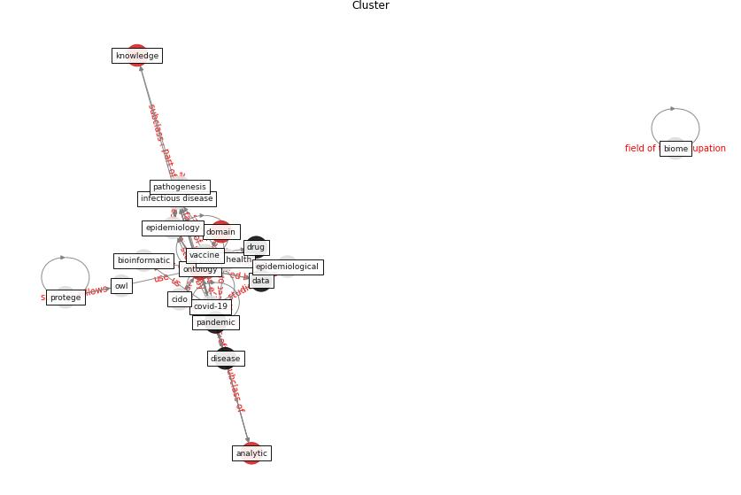

# Cluster: __ontology-datum__ (cluster5)
## Keywords

* [ontology](keyword_ontology), [datum](keyword_datum), [disease](keyword_disease), [biomedical](keyword_biomedical), [analytic](keyword_analytic), [model](keyword_model), [drug](keyword_drug), [semantic](keyword_semantic), [knowledge](keyword_knowledge), [domain](keyword_domain), [study](keyword_study), [base](keyword_base), [solution](keyword_solution), [data](keyword_data), [ontological](keyword_ontological), [infectious](keyword_infectious), [interoperability](keyword_interoperability), [representation](keyword_representation), [tool](keyword_tool), [support](keyword_support)

## Concepts

 

## Articles

* An Overview of Ontologies and Tool Support for
COVID-19 Analytics ([ahmad_overview_2021](article_ahmad_overview_2021))
* CIDO, a community-based ontology for coronavirus disease
knowledge and data integration, sharing, and analysis ([he_cido_2020](article_he_cido_2020))
* An Overview of Biomedical Ontologies for Pandemics
and Infectious Diseases Representation ([bayoudhi_overview_2021](article_bayoudhi_overview_2021))
* The COVID-19 epidemiology and monitoring ontology ([queralt-rosinach_covid-19_2021](article_queralt-rosinach_covid-19_2021))
