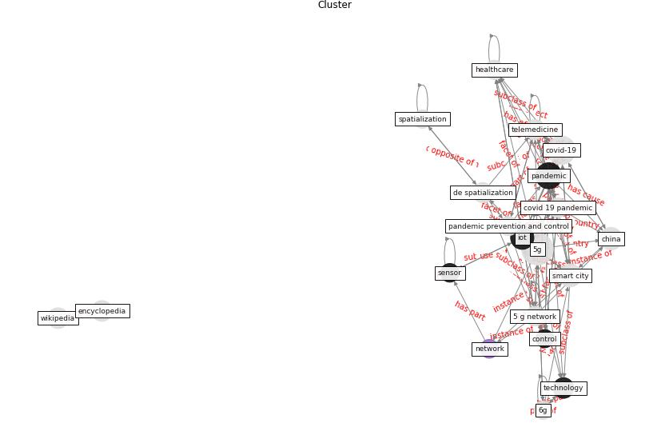

# Cluster: __simulation-model__ (cluster6)
## Keywords

* [simulation](keyword_simulation), [model](keyword_model), [agent](keyword_agent), [city](keyword_city), [scenario](keyword_scenario), [mobility](keyword_mobility), [neighborhood](keyword_neighborhood), [urban](keyword_urban), [population](keyword_population), [spatial](keyword_spatial), [number](keyword_number), [epidemic](keyword_epidemic), [trip](keyword_trip), [influenza](keyword_influenza), [time](keyword_time), [phase](keyword_phase), [biorxiv](keyword_biorxiv), [parameter](keyword_parameter), [probability](keyword_probability), [vaccination](keyword_vaccination)

## Concepts

 

## Articles

* COVID-ABS: An agent-based model of COVID-19
epidemic to simulate health and economic effects of social
distancing interventions ([silva_covid-abs_2020](article_silva_covid-abs_2020))
* Understanding the role of urban design in disease
spreading ([brizuela_understanding_2019](article_brizuela_understanding_2019))
* RUDDS_bioRxiv_update ([RUDDS_bioRxiv_update](article_RUDDS_bioRxiv_update))
* Digital Twin of COVID-19 Mass Vaccination
Centers ([pilati_digital_2021](article_pilati_digital_2021))
