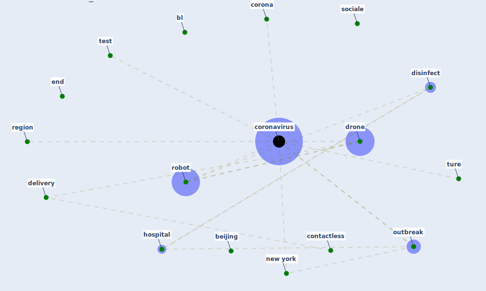

# Cluster: __sociale-drone__ (Cluster_6)

## Keywords

 * [aalborg](keyword_aalborg), [ad](keyword_ad), [analyst](keyword_analyst), [bare](keyword_bare), [beijing](keyword_beijing), [bl](keyword_bl), [company](keyword_company), [contactless](keyword_contactless), [corona](keyword_corona), [coronavirus](keyword_coronavirus), [delivery](keyword_delivery), [disinfect](keyword_disinfect), [dog](keyword_dog), [dow](keyword_dow), [drone](keyword_drone), [edition](keyword_edition), [end](keyword_end), [gang](keyword_gang), [god](keyword_god), [grad](keyword_grad), [handler](keyword_handler), [hj](keyword_hj), [hospital](keyword_hospital), [html](keyword_html), [index](keyword_index), [isr](keyword_isr), [jones](keyword_jones), [lang](keyword_lang), [liv](keyword_liv), [llc](keyword_llc), [ne](keyword_ne), [new york](keyword_new_york), [outbreak](keyword_outbreak), [region](keyword_region), [robot](keyword_robot), [say](keyword_say), [se](keyword_se), [silicon](keyword_silicon), [sit](keyword_sit), [sm](keyword_sm), [smitte](keyword_smitte), [sociale](keyword_sociale), [store](keyword_store), [str](keyword_str), [test](keyword_test), [trademark](keyword_trademark), [tt](keyword_tt), [ture](keyword_ture), [type](keyword_type), [ville](keyword_ville)

## Concepts

 

# Linked articles

* Pandemiens arkitektur - [LINK](article_realdania_pandemiens_2022)
* Refleksioner fra en pandemi - [LINK](article_realdania_refleksioner_2022)
* Drones. Disinfecting robots. Supercomputers. The coronavirus outbreak is a test for China's tech industry \textbar CNN Business - [LINK](article_wang_drones_2020)
