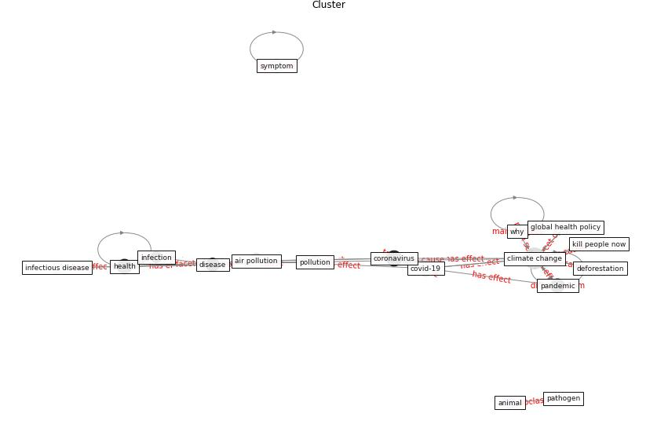

# Cluster: __building-space__ (cluster7)
## Keywords

* [building](keyword_building.md), [space](keyword_space.md), [health](keyword_health.md), [air](keyword_air.md), [energy](keyword_energy.md), [environment](keyword_environment.md), [occupant](keyword_occupant.md), [pandemic](keyword_pandemic.md), [office](keyword_office.md), [system](keyword_system.md), [ieq](keyword_ieq.md), [indoor](keyword_indoor.md), [design](keyword_design.md), [build](keyword_build.md), [work](keyword_work.md), [mental](keyword_mental.md), [green](keyword_green.md), [study](keyword_study.md), [people](keyword_people.md), [home](keyword_home.md)

## Concepts

 

## Articles
* hull_covid-19_2020 ([hull_covid-19_2020](article_hull_covid-19_2020.md))
* lam_smart_2021 ([lam_smart_2021](article_lam_smart_2021.md))
* How to Make Green Building Certification \&
Rating Systems More Pandemic-Sustainable? ([ujikawa_how_2022](article_ujikawa_how_2022.md))
* sarvari_global_2022-1 ([sarvari_global_2022-1](article_sarvari_global_2022-1.md))
* Continuous IEQ monitoring system: Context and
development ([parkinson_continuous_2019](article_parkinson_continuous_2019.md))
* Ten questions concerning occupant health in buildings
during normal operations and extreme events including the
COVID-19 pandemic ([awada_ten_2021](article_awada_ten_2021.md))
* Occupants’ behavior and activity patterns influencing
the energy consumption in the Kuwaiti residences ([al-mumin_occupants_2003](article_al-mumin_occupants_2003.md))
* world_green_building_council_contribution_2020 ([world_green_building_council_contribution_2020](article_world_green_building_council_contribution_2020.md))
* Towards Resilient Residential Buildings and
Neighborhoods in Light of COVID-19 Pandemic—The
Scenario of Podgorica, Montenegro ([bojovic_towards_2022](article_bojovic_towards_2022.md))
* Antivirus-built environment: Lessons learned from
Covid-19 pandemic ([megahed_antivirus-built_2020](article_megahed_antivirus-built_2020.md))
* COVID-19 Could Leverage a Sustainable Built
Environment ([pinheiro_covid-19_2020](article_pinheiro_covid-19_2020.md))
* A Global Survey of Infection Control and
Mitigation Measures for Combating the Transmission
of COVID-19 Pandemic in Buildings Under
Facilities Management Services ([sarvari_global_2022](article_sarvari_global_2022.md))
* A comprehensive review on indoor air quality monitoring
systems for enhanced public health ([saini_comprehensive_2020](article_saini_comprehensive_2020.md))
* An Intelligent IEQ Monitoring and Feedback
System: Development and Applications ([geng_intelligent_2021](article_geng_intelligent_2021.md))
* world_green_building_council_health_2014 ([world_green_building_council_health_2014](article_world_green_building_council_health_2014.md))
* p15-lee-vor ([p15-lee-vor](article_p15-lee-vor.md))
* The effect of a redesigned floor plan, occupant density
and the quality of indoor climate on the cost of space,
productivity and sick leave in an office building–A
case study ([saari_effect_2006](article_saari_effect_2006.md))
* Addressing the impact of COVID-19 lockdown on energy use
in municipal buildings: A case study in Florianópolis,
Brazil ([geraldi_addressing_2021](article_geraldi_addressing_2021.md))
* chayka_how_2020 ([chayka_how_2020](article_chayka_how_2020.md))
* Occupant health in buildings: Impact of the COVID-19
pandemic on the opinions of building professionals and
implications on research ([awada_occupant_2022](article_awada_occupant_2022.md))
* Readiness Assessment of Green Building
Certification Systems for Residential Buildings
during Pandemics ([tleuken_readiness_2021](article_tleuken_readiness_2021.md))
* Assessment of COVID-19 precautionary measures in sports
facilities: A case study on a health club in Saudi
Arabia ([ibrahim_assessment_2022](article_ibrahim_assessment_2022.md))
* COVID-19 and Green Housing: A Review of
Relevant Literature ([kaklauskas_covid-19_2021](article_kaklauskas_covid-19_2021.md))
* RESIDENTIAL ARCHITECTURE IN A POST-PANDEMIC
WORLD: IMPLICATIONS OF COVID-19 FOR NEW
CONSTRUCTION AND FOR ADAPTING HERITAGE
BUILDINGS ([spennemann_residential_2021](article_spennemann_residential_2021.md))
* A Mixed Approach on Resilience of Spanish
Dwellings and Households during COVID-19 Lockdown ([cuerdo-vilches_mixed_2020](article_cuerdo-vilches_mixed_2020.md))
* Social distancing enhanced automated optimal design of
physical spaces in the wake of the COVID-19 pandemic ([ugail_social_2021](article_ugail_social_2021.md))
* Green Buildings: A Post COVID-19 Analysis of
Preventive Measures of Spreading the Virus ([yakubu_aminu_dodo_green_2020](article_yakubu_aminu_dodo_green_2020.md))
* COVID-19 Experience Transforming the Protective
Environment of Office Buildings and Spaces ([phapant_covid-19_2021](article_phapant_covid-19_2021.md))
* Navigating Climate Change: Rethinking the Role of
Buildings ([cole_navigating_2020](article_cole_navigating_2020.md))
* Biophilic design in architecture and its contributions to
health, well-being, and sustainability: A critical
review ([zhong_biophilic_2022](article_zhong_biophilic_2022.md))
* The effect of occupant distribution on energy consumption
and COVID-19 infection in buildings: A case study of
university building ([mokhtari_effect_2021](article_mokhtari_effect_2021.md))
* Architectural Design Drives the Biogeography of
Indoor Bacterial Communities ([kembel_architectural_2014](article_kembel_architectural_2014.md))
* Prophylactic Architecture: Formulating the Concept
of Pandemic-Resilient Homes ([elrayies_prophylactic_2022](article_elrayies_prophylactic_2022.md))
* Assessment method for new sustainability indicators
providing pandemic resilience for residential buildings ([tokazhanov_assessment_2021](article_tokazhanov_assessment_2021.md))
* Scalable IoT Architecture for Monitoring IEQ
Conditions in Public and Private Buildings ([calvo_scalable_2022](article_calvo_scalable_2022.md))
* Designing a Multi-Agent Occupant Simulation
System to Support Facility Planning and Analysis
for COVID-19 ([lee_designing_2021](article_lee_designing_2021.md))
* Assessment of Building Automation and Control
Systems in Danish Healthcare Facilities in the
COVID-19 Era ([pedersen_assessment_2022](article_pedersen_assessment_2022.md))
* hmc_architects_how_2020 ([hmc_architects_how_2020](article_hmc_architects_how_2020.md))
* Adaptive Design of the Built Environment to
Mitigate the Transmission Risk of COVID-19 ([ara_dilshad_shangi_adaptive_2020](article_ara_dilshad_shangi_adaptive_2020.md))
