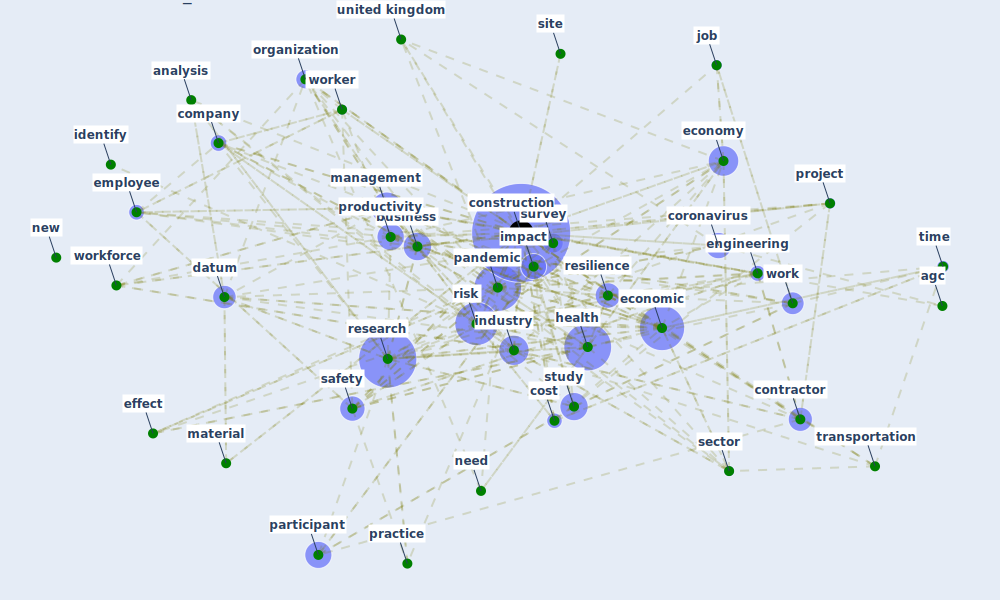

# Cluster: __construction-project__ (Cluster_8)

## Keywords

 * [agc](keyword_agc), [analysis](keyword_analysis), [arlington](keyword_arlington), [business](keyword_business), [company](keyword_company), [conference](keyword_conference), [construction](keyword_construction), [contractor](keyword_contractor), [coronavirus](keyword_coronavirus), [cost](keyword_cost), [datum](keyword_datum), [due](keyword_due), [economic](keyword_economic), [economy](keyword_economy), [effect](keyword_effect), [employee](keyword_employee), [engineering](keyword_engineering), [health](keyword_health), [identify](keyword_identify), [impact](keyword_impact), [industry](keyword_industry), [job](keyword_job), [management](keyword_management), [material](keyword_material), [nassereddine](keyword_nassereddine), [need](keyword_need), [new](keyword_new), [organization](keyword_organization), [pandemic](keyword_pandemic), [participant](keyword_participant), [percent](keyword_percent), [practice](keyword_practice), [productivity](keyword_productivity), [project](keyword_project), [research](keyword_research), [resilience](keyword_resilience), [respondent](keyword_respondent), [risk](keyword_risk), [safety](keyword_safety), [sector](keyword_sector), [site](keyword_site), [study](keyword_study), [supply](keyword_supply), [survey](keyword_survey), [time](keyword_time), [transportation](keyword_transportation), [united kingdom](keyword_united_kingdom), [work](keyword_work), [worker](keyword_worker), [workforce](keyword_workforce)

## Concepts

 

# Linked articles

* Influence between COVID-19 Impacts and Project Stakeholders in Chilean Construction Projects - [LINK](article_araya_influence_2021)
* Guidelines for Responding to COVID-19 Pandemic: Best Practices, Impacts, and Future Research Directions - [LINK](article_assaad_guidelines_2021)
* Analysis of COVID-19 Concerns Raised by the Construction Workforce and Development of Mitigation Practices - [LINK](article_bou_hatoum_analysis_2021)
* Covid-19 Associated Risks and Mitigation Strategies relevant for the UK Construction Industry - [LINK](article_dan-jumbo_covid-19_2021)
* The Impact of Pandemic Crisis on the Survival of Construction Industry: A Case of COVID-19 - [LINK](article_gamil_impact_2020)
* Overcoming the Impact of COVID-19 Using Integrated Project Delivery Model - [LINK](article_g_overcoming_2020)
* Strategies to Mitigate COVID-19 Pandemic Impacts on Health and Safety of Workers in Construction Projects - [LINK](article_kaushal_strategies_2021)
* Mechanisms for addressing the impact of COVID-19 on infrastructure projects - [LINK](article_king_mechanisms_2021)
* Propositions for a Resilient, Post-COVID-19 Future for the AEC Industry - [LINK](article_nassereddine_propositions_2021)
* COVID-19 pandemic: the effects and prospects in the construction industry. - [LINK](article_ogunnusi_covid-19_2020)
* Effects to Construction Project Management Impacted Circular Economic of Covid-19 Pandemic - [LINK](article_paikan_effects_2021)
* Impacts of COVID-19 on Health and Safety of Workforce in Construction Industry - [LINK](article_pamidimukkala_impacts_2021)
* Identifying Actions to Control and Mitigate the Effects of the COVID-19 Pandemic on Construction Organizations: Preliminary Findings - [LINK](article_raoufi_identifying_2021)
* Perception of COVID-19 impacts on the construction industry over time - [LINK](article_rokooei_perception_2022)
* The Effects of Pandemic on Construction Industry in the UK - [LINK](article_shibani_effects_2020)
