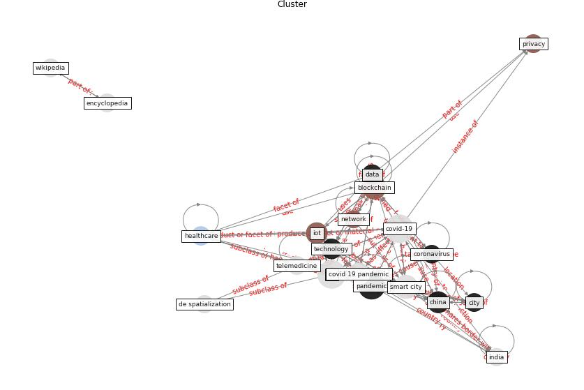

# Cluster: __customer-brand__ (Cluster_8)

## Keywords

 * [agility](keyword_agility), [brand](keyword_brand), [business](keyword_business), [capability](keyword_capability), [consumer](keyword_consumer), [customer](keyword_customer), [employee](keyword_employee), [firm](keyword_firm), [food](keyword_food), [marketing](keyword_marketing), [new](keyword_new), [pandemic](keyword_pandemic), [retail](keyword_retail), [retailer](keyword_retailer), [retailing](keyword_retailing), [service](keyword_service), [sme](keyword_sme), [social](keyword_social), [store](keyword_store), [truck](keyword_truck)

## Concepts

 

# Linked articles

* How COVID-19 Could Accelerate the Adoption of New Retail Technologies and Enhance the (E-)Servicescape - [LINK](article_willems_how_2021)
