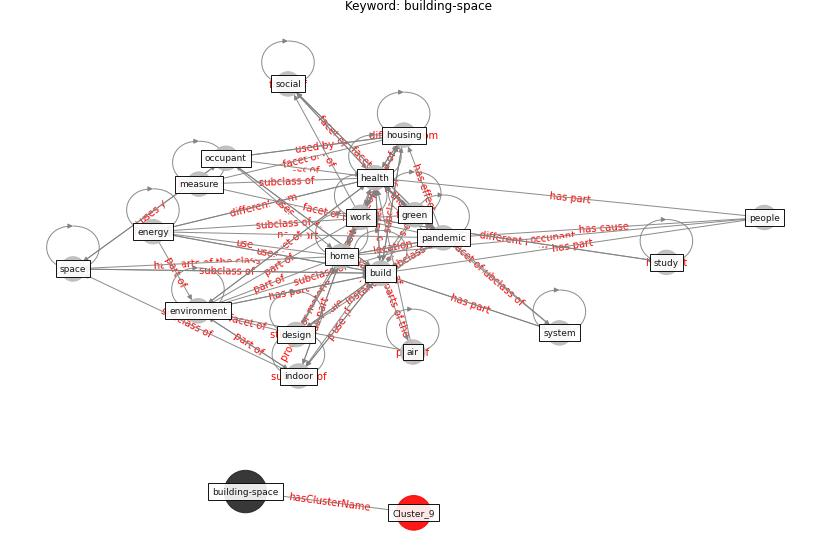

# Cluster: __construction-project__ (cluster9)
## Keywords

* [construction](keyword_construction), [project](keyword_project), [industry](keyword_industry), [impact](keyword_impact), [pandemic](keyword_pandemic), [worker](keyword_worker), [work](keyword_work), [respondent](keyword_respondent), [contractor](keyword_contractor), [study](keyword_study), [employee](keyword_employee), [engineering](keyword_engineering), [safety](keyword_safety), [health](keyword_health), [workforce](keyword_workforce), [company](keyword_company), [site](keyword_site), [participant](keyword_participant), [transportation](keyword_transportation), [management](keyword_management)

## Concepts

 

## Articles

* Influence between COVID-19 Impacts and Project
Stakeholders in Chilean Construction Projects ([araya_influence_2021](article_araya_influence_2021))
* ogunnusi_covid-19_2020 ([ogunnusi_covid-19_2020](article_ogunnusi_covid-19_2020))
* Guidelines for Responding to COVID-19 Pandemic:
Best Practices, Impacts, and Future Research
Directions ([assaad_guidelines_2021](article_assaad_guidelines_2021))
* Overcoming the Impact of COVID-19 Using Integrated
Project Delivery Model ([g_overcoming_2020](article_g_overcoming_2020))
* Identifying Actions to Control and Mitigate the
Effects of the COVID-19 Pandemic on Construction
Organizations: Preliminary Findings ([raoufi_identifying_2021](article_raoufi_identifying_2021))
* nassereddine_propositions_2021 ([nassereddine_propositions_2021](article_nassereddine_propositions_2021))
* The Impact of Pandemic Crisis on the Survival of
Construction Industry: A Case of COVID-19 ([gamil_impact_2020](article_gamil_impact_2020))
* Impacts of COVID-19 on Health and Safety of
Workforce in Construction Industry ([pamidimukkala_impacts_2021](article_pamidimukkala_impacts_2021))
* Perception of COVID-19 impacts on the construction
industry over time ([rokooei_perception_2022](article_rokooei_perception_2022))
* Effects to Construction Project Management
Impacted Circular Economic of Covid-19 Pandemic ([paikan_effects_2021](article_paikan_effects_2021))
* Mechanisms for addressing the impact of COVID-19 on
infrastructure projects ([king_mechanisms_2021](article_king_mechanisms_2021))
* Analysis of COVID-19 Concerns Raised by the
Construction Workforce and Development of
Mitigation Practices ([bou_hatoum_analysis_2021](article_bou_hatoum_analysis_2021))
* Covid-19 Associated Risks and Mitigation
Strategies relevant for the UK Construction
Industry ([dan-jumbo_covid-19_2021](article_dan-jumbo_covid-19_2021))
* The Effects of Pandemic on Construction Industry
in the UK ([shibani_effects_2020](article_shibani_effects_2020))
* Strategies to Mitigate COVID-19 Pandemic Impacts
on Health and Safety of Workers in Construction
Projects ([kaushal_strategies_2021](article_kaushal_strategies_2021))
