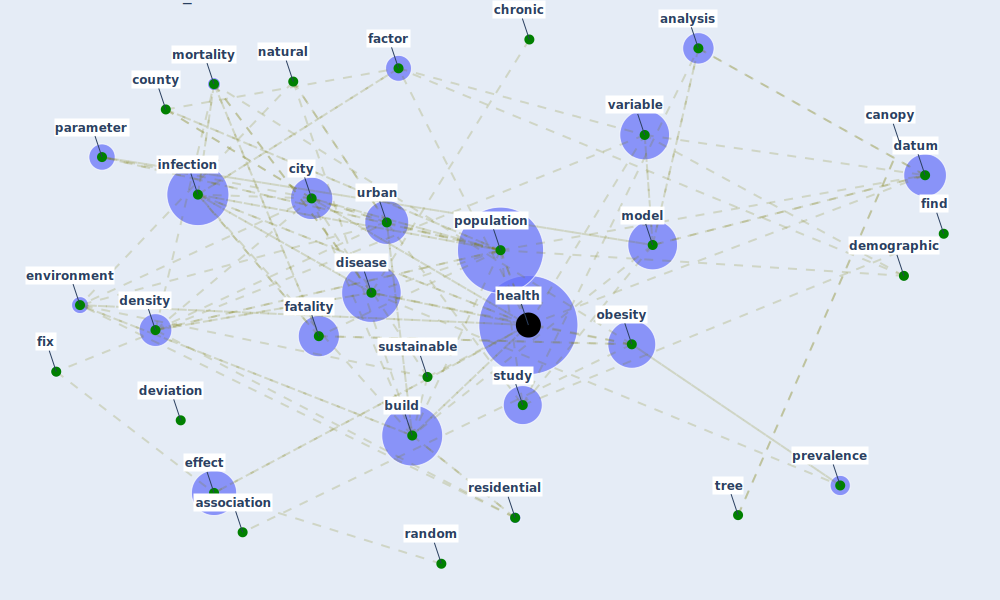

# Cluster: __obesity-county__ (Cluster_9)

## Keywords

 * [active](keyword_active), [analysis](keyword_analysis), [association](keyword_association), [auto](keyword_auto), [build](keyword_build), [canopy](keyword_canopy), [capture](keyword_capture), [centrality](keyword_centrality), [chronic](keyword_chronic), [city](keyword_city), [correlate](keyword_correlate), [county](keyword_county), [datum](keyword_datum), [demographic](keyword_demographic), [density](keyword_density), [deviation](keyword_deviation), [disease](keyword_disease), [effect](keyword_effect), [environment](keyword_environment), [factor](keyword_factor), [fatality](keyword_fatality), [find](keyword_find), [fix](keyword_fix), [fix](keyword_fix), [frank](keyword_frank), [hamidi](keyword_hamidi), [health](keyword_health), [heterogeneity](keyword_heterogeneity), [indirect](keyword_indirect), [infection](keyword_infection), [model](keyword_model), [mortality](keyword_mortality), [natural](keyword_natural), [obesity](keyword_obesity), [parameter](keyword_parameter), [population](keyword_population), [prevalence](keyword_prevalence), [random](keyword_random), [rate](keyword_rate), [relationship](keyword_relationship), [residential](keyword_residential), [salli](keyword_salli), [study](keyword_study), [sustainable](keyword_sustainable), [tree](keyword_tree), [unobserved](keyword_unobserved), [urban](keyword_urban), [variable](keyword_variable), [walkability](keyword_walkability), [walkable](keyword_walkable)

## Concepts

 

# Linked articles

* Treating two pandemics for the price of one: Chronic and infectious disease impacts of the built and natural environment - [LINK](article_frank_treating_2021)
