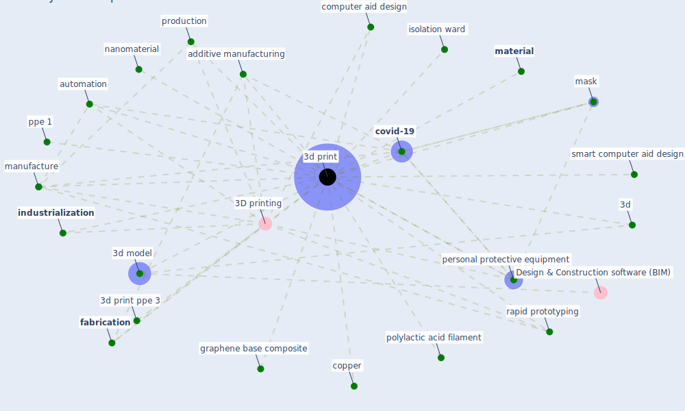

# Keyword: 3d print

## Keywords

 * 3d, 3d model, [3d print](keyword_3d_print), 3d print ppe 3, 3d printed, 3d printing, 3d prints, additive manufacturing, automation, computer aid design, [copper](keyword_copper), [covid-19](keyword_covid-19), [fabrication](keyword_fabrication), graphene base composite, [industrialization](keyword_industrialization), isolation ward, [manufacture](keyword_manufacture), [mask](keyword_mask), [material](keyword_material), nanomaterial, [personal protective equipment](keyword_personal_protective_equipment), polylactic acid filament, ppe 1, production, rapid prototyping, smart computer aid design

## Mapping

## Neighbours

### Closest articles

* Supporting Technologies for COVID-19 Prevention: Systemized Review - [LINK](article_zhao_supporting_2022)
* Propositions for a Resilient, Post-COVID-19 Future for the AEC Industry - [LINK](article_nassereddine_propositions_2021)
* Graphene-based nanomaterials as antimicrobial surface coatings: A parallel approach to restrain the expansion of COVID-19 - [LINK](article_ayub_graphene-based_2021)
* 10 tech trends getting us through the COVID-19 pandemic - [LINK](article_yan_10_2020)
* Contributions of Smart City Solutions and Technologies to Resilience against the COVID-19 Pandemic: A Literature Review - [LINK](article_sharifi_contributions_2021)
* Emerging Technologies to Combat the COVID-19 Pandemic - [LINK](article_vaishya_emerging_2020)
* Sars-CoV-2 (COVID-19) inactivation capability of copper-coated touch surface fabricated by cold-spray technology - [LINK](article_hutasoit_sars-cov-2_2020)
* The COVID-19 pandemic: Lessons on building more equal and sustainable societies - [LINK](article_van_barneveld_covid-19_2020)

### Closest BPs

