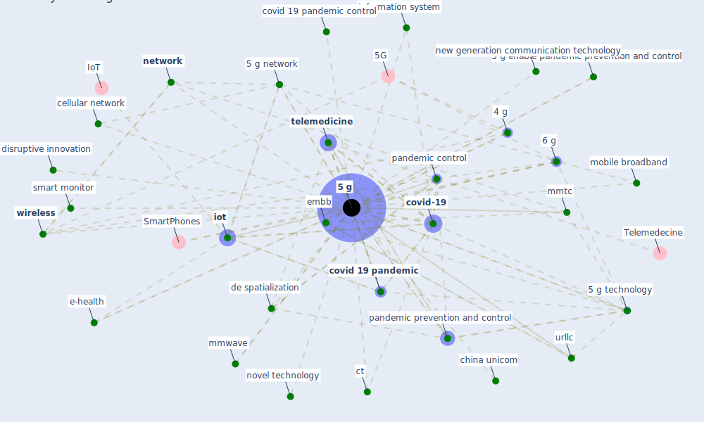

# Keyword: 5 g

## Keywords

 * 1 millisecond, 4 g, [5 g](keyword_5_g), 5 g base, 5 g base equipment, 5 g base iot and sensor, 5 g base technology, 5 g enable e health solution, 5 g enable logistic support, 5 g enable pandemic prevention and control, 5 g enhance mobile broadband, 5 g faq, [5 g network](keyword_5_g_network), 5 g technology, 5ghz, 5th generation communication, [6 g](keyword_6_g), affordance, [application](keyword_application), broadcast system, cellular network, [china](keyword_china), china mobile, china unicom, cloud computing, communication, conspiracy theory, contradictory task, [covid 19 pandemic](keyword_covid_19_pandemic), covid 19 pandemic control, covid 19 pandemic prevention and control, [covid-19](keyword_covid-19), ct, [de spatialization](keyword_de_spatialization), delay, delivery robot, disruptive innovation, [download](keyword_download), e-health, electromagnetic field, embb, gigabit, [healthcare](keyword_healthcare), information system, infrastruc ture, [internet](keyword_internet), [iot](keyword_iot), iot device, iot in pocket, l5go, [lockdown](keyword_lockdown), massive connectivity regime, mec, mmtc, mmwave, mobile broadband, mobile communication, mobile network, n, nb iot lora, [network](keyword_network), new generation communication technology, nfv, non contact, non contact people screen, non contact people screen system, novel technology, on5 g, pandemic control, pandemic control and prevention, [pandemic prevention and control](keyword_pandemic_prevention_and_control), [robot](keyword_robot), robot arm, [smart city](keyword_smart_city), smart monitor, [social](keyword_social), solid infrastructure construction, [technology](keyword_technology), tele commute, tele diagnosis, telecommunication infrastructure, telecommunication network, telecommute, [telehealth](keyword_telehealth), telemedical, [telemedicine](keyword_telemedicine), ubiquitous communication, ultra high definition, ultra low latency, urcll, urllc, use case, what be 5 g, wirel, wireless, wireless communication, wireless network, wireless technology, [wuhan](keyword_wuhan), yat sen

## Mapping

## Neighbours

### Closest articles

* How the 5G Enabled the COVID-19 Pandemic Prevention and Control: Materiality, Affordance, and (De-)Spatialization - [LINK](article_li_how_2022)
* Design COVID-19 Ontology: A Healthcare and Safety Perspective - [LINK](article_aloulou_design_2022)
* The role of 5G for digital healthcare against COVID-19 pandemic: Opportunities and challenges - [LINK](article_siriwardhana_role_2021)
* Future (post-COVID) digital, smart and sustainable cities in the wake of 6G: Digital twins, immersive realities and new urban economies - [LINK](article_allam_future_2021)
* A Comprehensive Review of the COVID-19 Pandemic and the Role of IoT, Drones, AI, Blockchain, and 5G in Managing its Impact - [LINK](article_chamola_comprehensive_2020)
* Contributions of Smart City Solutions and Technologies to Resilience against the COVID-19 Pandemic: A Literature Review - [LINK](article_sharifi_contributions_2021)
* Leveraging Digital Transformation Technologies to Tackle COVID-19: Proposing a Privacy-First Holistic Framework - [LINK](article_arpaci_leveraging_2021)
*  - [LINK](article_dalessandro_covid-19_2020)
* Impact of COVID-19 on IoT Adoption in Healthcare, Smart Homes, Smart Buildings, Smart Cities, Transportation and Industrial IoT - [LINK](article_umair_impact_2021)
* 10 tech trends getting us through the COVID-19 pandemic - [LINK](article_yan_10_2020)

### Closest BPs

