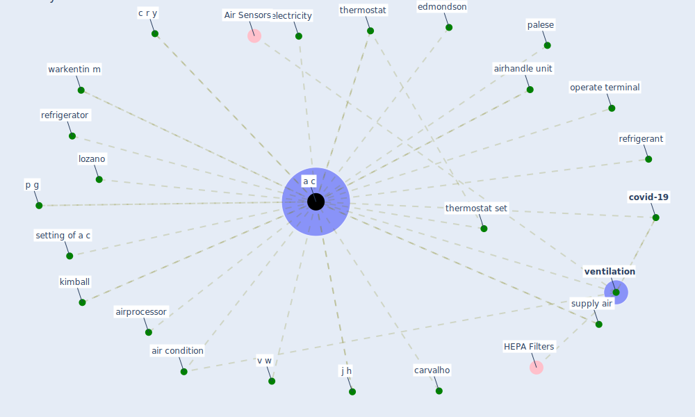

# Keyword: a c

## Keywords

 * [a c](keyword_a_c), air condition, airhandle unit, airprocessor, c r y, carvalho, [covid-19](keyword_covid-19), edmondson, electricity, j h, kimball, lozano, operate terminal, p g, palese, refrigerant, refrigerator, setting of a c, supply air, [thermostat](keyword_thermostat), thermostat set, v w, [ventilation](keyword_ventilation), warkentin m

## Mapping

## Neighbours

### Closest articles

* Occupants’ behavior and activity patterns influencing the energy consumption in the Kuwaiti residences - [LINK](article_al-mumin_occupants_2003)
* A critical review of heating, ventilation, and air conditioning (HVAC) systems within the context of a global SARS-CoV-2 epidemic - [LINK](article_elsaid_critical_2021)
* Current knowledge of COVID-19: Advances, challenges and future perspectives - [LINK](article_wu_current_2021)
* Should I Stay or Should I Go? Tourists’ COVID-19 Risk Perception and Vacation Behavior Shift - [LINK](article_bratic_should_2021)
* The impact of COVID-19 and strategies for mitigation and suppression in low- and middle-income countries - [LINK](article_walker_impact_2020)
* COVID-19 Prevention and Control Measures in Workplace Settings: A Rapid Review and Meta-Analysis - [LINK](article_ingram_covid-19_2021)
* Disinfection technology of hospital wastes and wastewater: Suggestions for disinfection strategy during coronavirus Disease 2019 (COVID-19) pandemic in China - [LINK](article_wang_disinfection_2020)
* How COVID-19 Could Accelerate the Adoption of New Retail Technologies and Enhance the (E-)Servicescape - [LINK](article_willems_how_2021)
* Design COVID-19 Ontology: A Healthcare and Safety Perspective - [LINK](article_aloulou_design_2022)
* ASHRAE Position Document on Infectious Aerosols - [LINK](article_ashrae_ashrae_2022)

### Closest BPs

