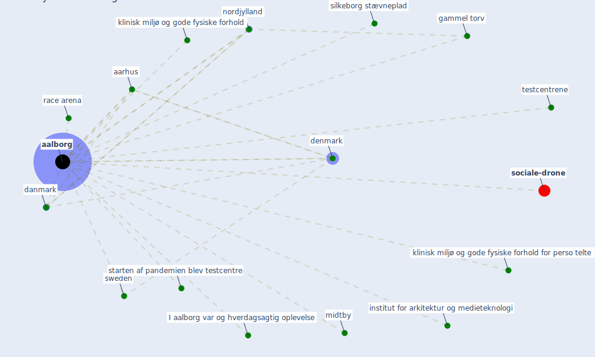

# Keyword: aalborg

* [sociale-drone](cluster_6)

## Keywords

 * Cluster_6, I aalborg var og hverdagsagtig oplevelse, [aalborg](keyword_aalborg), aarhus, [danmark](keyword_danmark), [denmark](keyword_denmark), gammel torv, institut for arkitektur og medieteknologi, klinisk miljø og gode fysiske forhold, klinisk miljø og gode fysiske forhold for perso telte, midtby, [nordjylland](keyword_nordjylland), race arena, silkeborg stævneplad, starten af pandemien blev testcentre, [sweden](keyword_sweden), testcentrene

## Mapping

## Neighbours

### Closest articles

* Pandemiens arkitektur - [LINK](article_realdania_pandemiens_2022)
* Refleksioner fra en pandemi - [LINK](article_realdania_refleksioner_2022)
* Impact of COVID-19 on IoT Adoption in Healthcare, Smart Homes, Smart Buildings, Smart Cities, Transportation and Industrial IoT - [LINK](article_umair_impact_2021)
* Assessment of Building Automation and Control Systems in Danish Healthcare Facilities in the COVID-19 Era - [LINK](article_pedersen_assessment_2022)

### Closest BPs

