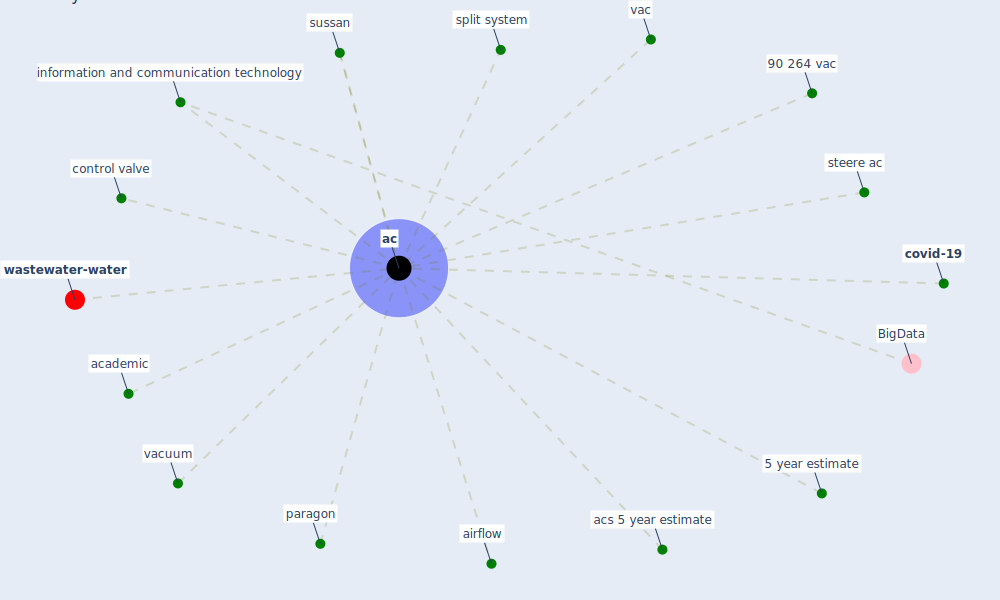

# Keyword: ac

* [wastewater-water](cluster_0)

## Keywords

 * 5 year estimate, 90 264 vac, Cluster_0, [ac](keyword_ac), academic, acs, acs 5 year estimate, airflow, control valve, [covid-19](keyword_covid-19), information and communication technology, paragon, split system, steere ac, sussan, vac, vacuum

## Mapping

## Neighbours

### Closest articles

* Study of COVID-19 pandemic in London (UK) from urban context - [LINK](article_ghosh_study_2020)
* Making green infrastructure healthier infrastructure - [LINK](article_lohmus_making_2015)
* Continuous IEQ monitoring system: Context and development - [LINK](article_parkinson_continuous_2019)
* Assessment method for new sustainability indicators providing pandemic resilience for residential buildings - [LINK](article_tokazhanov_assessment_2021)
* A Surface Coating that Rapidly Inactivates SARS-CoV-2 - [LINK](article_behzadinasab_surface_2020)
* Air Disinfection for Airborne Infection Control with a Focus on COVID‐19: Why Germicidal UV is Essential             † - [LINK](article_nardell_air_2021)
* <scp>COVID</scp>             ‐19: Small and medium enterprises challenges and responses with creativity, innovation, and entrepreneurship - [LINK](article_thukral_covid19_2021)
* Urban design attributes and resilience: COVID-19 evidence from New York City - [LINK](article_yang_urban_2021)
* Review and comparison of HVAC operation guidelines in different countries during the COVID-19 pandemic - [LINK](article_guo_review_2021)

### Closest BPs

