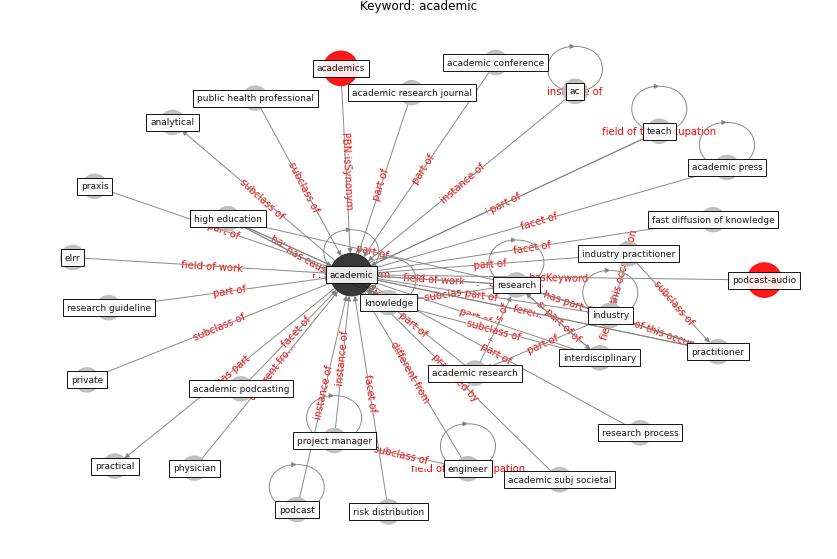

# Keyword: academic

* [podcast-audio](cluster_Cluster_7)

## Keywords

 * Cluster_7, ac, [academic](keyword_academic), academic conference, academic podcasting, academic press, academic research, academic research journal, academic subj societal, academics, analytical, disciplinary structure, discipline, elrr, employment structure, [engineer](keyword_engineer), evidence gathering, fast diffusion of knowledge, high education, [industry](keyword_industry), industry practitioner, [interdisciplinary](keyword_interdisciplinary), [knowledge](keyword_knowledge), physician, [podcast](keyword_podcast), practical, practitioner, praxis, private, project manager, public health professional, [research](keyword_research), research guideline, research process, risk distribution, teach

## Concepts

 

## Neighbours

### Closest articles

* The socio-economic determinants of COVID-19: A spatial analysis of German county level data - [LINK](article_ehlert_socio-economic_2021)
* Revisiting the built environment: 10 potential development changes and paradigm shifts due to COVID-19 - [LINK](article_cheshmehzangi_revisiting_2021)
* A Global Survey of Infection Control and Mitigation Measures for Combating the Transmission of COVID-19 Pandemic in Buildings Under Facilities Management Services - [LINK](article_sarvari_global_2022)
* Guidelines for Responding to COVID-19 Pandemic: Best Practices, Impacts, and Future Research Directions - [LINK](article_assaad_guidelines_2021)
* The City Under COVID‐19: Podcasting As Digital Methodology - [LINK](article_rogers_city_2020)
* Contextualizing the Covid-19 pandemic for a carbon-constrained world: Insights for sustainability transitions, energy justice, and research methodology - [LINK](article_sovacool_contextualizing_2020)
* Health, Wellbeing \& Productivity in Offices - [LINK](article_world_green_building_council_health_2014)
* Dangerous liaisons? Applying the social harm perspective to the social inequality, housing and health trifecta during the Covid-19 pandemic - [LINK](article_gurney_dangerous_2021)
* The COVID-19 pandemic: Lessons on building more equal and sustainable societies - [LINK](article_van_barneveld_covid-19_2020)
* How COVID-19 Could Accelerate the Adoption of New Retail Technologies and Enhance the (E-)Servicescape - [LINK](article_willems_how_2021)

### Closest BPs

