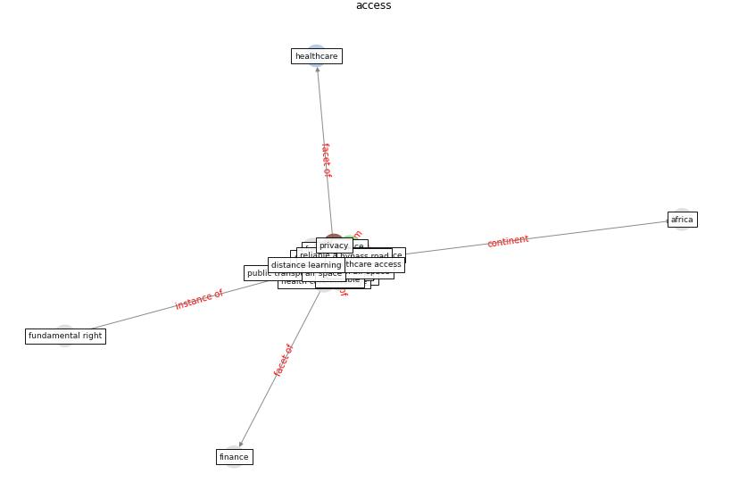

# Keyword: __access__
## Clusters

* Cluster 0: [health-city](cluster_0.md)
* Cluster 1: [om-ai](cluster_1.md)
* Cluster 9: [resilience-infrastructure](cluster_9.md)

## Concepts

 

## Articles
* Impact of COVID-19 on IoT Adoption in Healthcare,
Smart Homes, Smart Buildings, Smart Cities,
Transportation and Industrial IoT ([umair_impact_2021](article_umair_impact_2021.md))
* oecd_covid-19_2021 ([oecd_covid-19_2021](article_oecd_covid-19_2021.md))
* What has been the impact of the COVID-19 pandemic on
immigrants? An update on recent evidence ([oecd_what_2022](article_oecd_what_2022.md))
* unesco_case_2021 ([unesco_case_2021](article_unesco_case_2021.md))
* realdania_refleksioner_2022_EN ([realdania_refleksioner_2022_EN](article_realdania_refleksioner_2022_EN.md))
* Learning from pandemics: Applying resilience thinking to
identify priorities for planning urban settlements ([syal_learning_2021](article_syal_learning_2021.md))
* RESIDENTIAL ARCHITECTURE IN A POST-PANDEMIC
WORLD: IMPLICATIONS OF COVID-19 FOR NEW
CONSTRUCTION AND FOR ADAPTING HERITAGE
BUILDINGS ([spennemann_residential_2021](article_spennemann_residential_2021.md))
* The COVID-19 pandemic: Impacts on cities and major
lessons for urban planning, design, and management ([sharifi_covid-19_2020](article_sharifi_covid-19_2020.md))
* Pandemic Analytics: How Countries are Leveraging
Big Data Analytics and Artificial Intelligence to
Fight COVID-19? ([mehta_pandemic_2021](article_mehta_pandemic_2021.md))
* council_of_europe_2020_2020 ([council_of_europe_2020_2020](article_council_of_europe_2020_2020.md))
