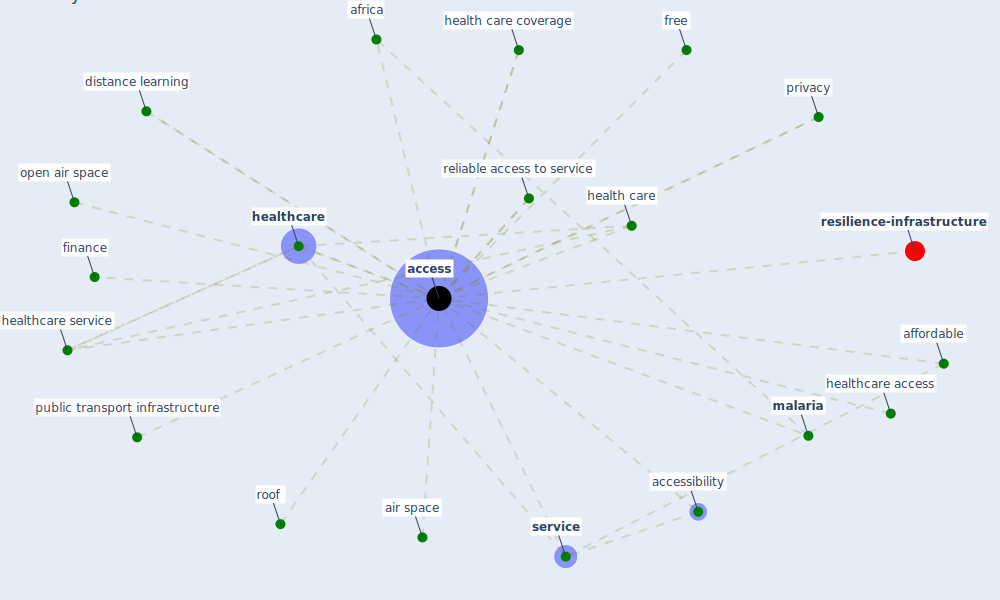

# Keyword: access

* [health-city](cluster_1)

* [space-housing](cluster_4)

* [building-design](cluster_5)

* [iot-blockchain](cluster_7)

* [business-customer](cluster_11)

## Keywords

 * Cluster_1, Cluster_11, Cluster_4, Cluster_5, Cluster_7, [access](keyword_access), accessibility, affordable, [africa](keyword_africa), air space, distance learning, finance, free, [health care](keyword_health_care), health care coverage, [healthcare](keyword_healthcare), healthcare access, healthcare service, [malaria](keyword_malaria), open air space, [privacy](keyword_privacy), public transport infrastructure, reliable access to service, [roof](keyword_roof), [service](keyword_service)

## Mapping

## Neighbours

### Closest articles

* Decision Making within the Built Environment as a Strategy for Mitigating the Risk of Malaria and Other Vector-Borne Diseases - [LINK](article_obonyo_decision_2018)
* Case Study on Finnish TVETA Resilient Model of Training During COVID-19 - [LINK](article_unesco_case_2021)
* Impact of COVID-19 on IoT Adoption in Healthcare, Smart Homes, Smart Buildings, Smart Cities, Transportation and Industrial IoT - [LINK](article_umair_impact_2021)
* COVID-19 and a new resilient infrastructure landscape - [LINK](article_oecd_covid-19_2021)
* What has been the impact of the COVID-19 pandemic on immigrants? An update on recent evidence - [LINK](article_oecd_what_2022)
* Pandemic Analytics: How Countries are Leveraging Big Data Analytics and Artificial Intelligence to Fight COVID-19? - [LINK](article_mehta_pandemic_2021)
* The COVID-19 pandemic: Impacts on cities and major lessons for urban planning, design, and management - [LINK](article_sharifi_covid-19_2020)
* RESIDENTIAL ARCHITECTURE IN A POST-PANDEMIC WORLD: IMPLICATIONS OF COVID-19 FOR NEW CONSTRUCTION AND FOR ADAPTING HERITAGE BUILDINGS - [LINK](article_spennemann_residential_2021)
* Learning from pandemics: Applying resilience thinking to identify priorities for planning urban settlements - [LINK](article_syal_learning_2021)

### Closest BPs

