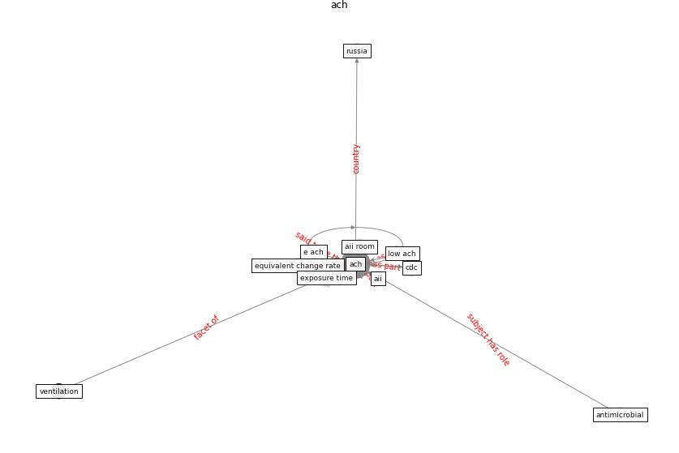

# Keyword: __ach__
## Clusters

* Cluster 11: [uvgi-uv](cluster_11)

## Concepts

 

## Articles
* Applications of ultraviolet germicidal irradiation
disinfection in health care facilities: Effective
adjunct, but not stand-alone technology ([memarzadeh_applications_2010](article_memarzadeh_applications_2010))
* Environmental factors involved in SARS-CoV-2
transmission: effect and role of indoor environmental
quality in the strategy for COVID-19 infection control ([azuma_environmental_2020](article_azuma_environmental_2020))
* A Review on Building Design as a Biomedical
System for Preventing COVID-19 Pandemic ([amran_review_2022](article_amran_review_2022))
* Air Disinfection for Airborne Infection Control
with a Focus on COVID-19: Why Germicidal UV is
Essential† ([nardell_air_2021](article_nardell_air_2021))
* COVID-19 and social inequalities: a complex and dynamic
interaction ([quantin_covid-19_2022](article_quantin_covid-19_2022))
* pricewaterhousecoopers_its_2021 ([pricewaterhousecoopers_its_2021](article_pricewaterhousecoopers_its_2021))
* When the fourth water and digital revolution encountered
COVID-19 ([poch_when_2020](article_poch_when_2020))
* COVID-19 Could Leverage a Sustainable Built
Environment ([pinheiro_covid-19_2020](article_pinheiro_covid-19_2020))
* Digital Twin of COVID-19 Mass Vaccination
Centers ([pilati_digital_2021](article_pilati_digital_2021))
* COVID-19 Experience Transforming the Protective
Environment of Office Buildings and Spaces ([phapant_covid-19_2021](article_phapant_covid-19_2021))
