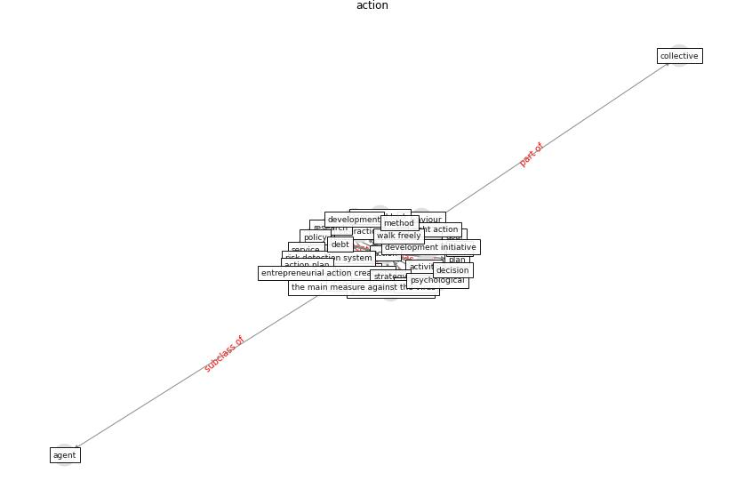

# Keyword: __action__
## Clusters

* Cluster 9: [climate-change](cluster_9)

## Concepts

 

## Top 10 articles for __action__
* oecd_guidelines_2014 ([oecd_guidelines_2014](article_oecd_guidelines_2014))
* who_strengthening_2017 ([who_strengthening_2017](article_who_strengthening_2017))
* COVID-ABS: An agent-based model of COVID-19
epidemic to simulate health and economic effects of social
distancing interventions ([silva_covid-abs_2020](article_silva_covid-abs_2020))
* harvard_th_chan_schoold_of_public_health_coronavirus_2020 ([harvard_th_chan_schoold_of_public_health_coronavirus_2020](article_harvard_th_chan_schoold_of_public_health_coronavirus_2020))
* Navigating Climate Change: Rethinking the Role of
Buildings ([cole_navigating_2020](article_cole_navigating_2020))
* eurofund_sustainable_2016 ([eurofund_sustainable_2016](article_eurofund_sustainable_2016))
* harvard_chan_community_coronavirus_2020 ([harvard_chan_community_coronavirus_2020](article_harvard_chan_community_coronavirus_2020))
* Exploring the Potential of Artificial Intelligence
and Machine Learning to Combat COVID-19 and
Existing Opportunities for LMIC: A Scoping
Review ([naseem_exploring_2020](article_naseem_exploring_2020))
* world_green_building_council_health_2014 ([world_green_building_council_health_2014](article_world_green_building_council_health_2014))
* realdania_refleksioner_2022_EN ([realdania_refleksioner_2022_EN](article_realdania_refleksioner_2022_EN))
