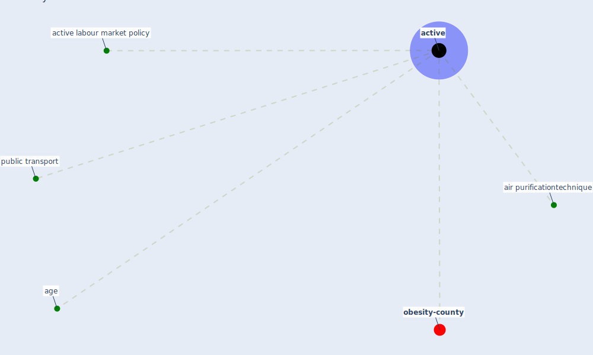

# Keyword: active

* [obesity-county](cluster_9)

## Keywords

 * Cluster_9, [active](keyword_active), active labour market policy, age, air purificationtechnique, [public transport](keyword_public_transport)

## Mapping

## Neighbours

### Closest articles

* Sustainable work throughout the life course: National policies and strategies, Publications Office of the European Union - [LINK](article_eurofund_sustainable_2016)
* A critical review of heating, ventilation, and air conditioning (HVAC) systems within the context of a global SARS-CoV-2 epidemic - [LINK](article_elsaid_critical_2021)
* Refleksioner fra en pandemi - [LINK](article_realdania_refleksioner_2022)
* Contextualizing the Covid-19 pandemic for a carbon-constrained world: Insights for sustainability transitions, energy justice, and research methodology - [LINK](article_sovacool_contextualizing_2020)

### Closest BPs

