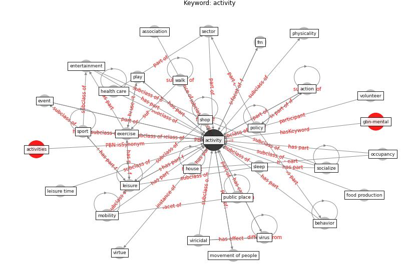

# Keyword: activity

* [gbn-mental](cluster_Cluster_0)

## Keywords

 * Cluster_0, [action](keyword_action), activities, [activity](keyword_activity), association, behavior, [business](keyword_business), [clean](keyword_clean), complex operation, contact, [datum](keyword_datum), dry activity course, entertainment, entertainment option, event, exercise, face to face contact, fm, food production, [health care](keyword_health_care), [house](keyword_house), leisure, leisure time, main activity sector, [mobility](keyword_mobility), movement of people, occupancy, outdoor space, passive, [people](keyword_people), physicality, planting, play, [policy](keyword_policy), project base learn, [public place](keyword_public_place), recreational, research focus, sector, shop, [sleep](keyword_sleep), socialize, [society](keyword_society), sport, task base, task base working solution, [travel](keyword_travel), [type](keyword_type), use the building, viricidal, virtue, [virus](keyword_virus), volunteer, walk, work solution

## Concepts

 

## Neighbours

### Closest articles

* A Review on Building Design as a Biomedical System for Preventing COVID-19 Pandemic - [LINK](article_amran_review_2022)
* COVID-19 Could Leverage a Sustainable Built Environment - [LINK](article_pinheiro_covid-19_2020)
* A critical analysis of the impacts of COVID-19 on the global economy and ecosystems and opportunities for circular economy strategies - [LINK](article_ibn-mohammed_critical_2021)
* COVID-19 and Green Housing: A Review of Relevant Literature - [LINK](article_kaklauskas_covid-19_2021)
* A Mixed Approach on Resilience of Spanish Dwellings and Households during COVID-19 Lockdown - [LINK](article_cuerdo-vilches_mixed_2020)
* Health, Wellbeing \& Productivity in Offices - [LINK](article_world_green_building_council_health_2014)
* COVID-19 Lockdown: Housing Built Environment’s Effects on Mental Health - [LINK](article_amerio_covid-19_2020)
* COVID-ABS: An agent-based model of COVID-19 epidemic to simulate health and economic effects of social distancing interventions - [LINK](article_silva_covid-abs_2020)
* Impact of Covid-19 on the built environment - [LINK](article_mahima_impact_2022)

### Closest BPs

