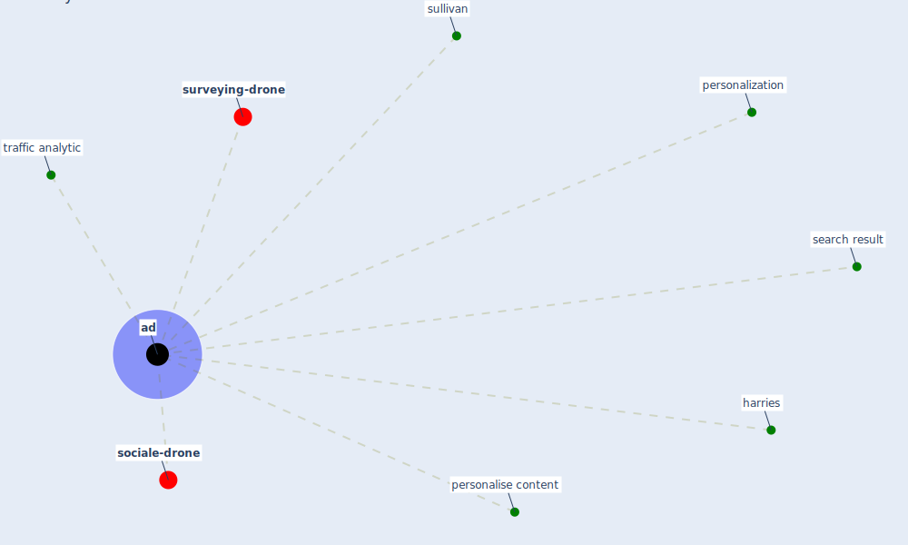

# Keyword: ad

* [surveying-drone](cluster_6)

* [sociale-drone](cluster_13)

## Keywords

 * Cluster_13, Cluster_6, [ad](keyword_ad), ads, harries, personalise content, [personalization](keyword_personalization), search result, sullivan, traffic analytic

## Mapping

## Neighbours

### Closest articles

* Will a pandemic change building codes? - [LINK](article_rozgus_will_2020)
* 10 tech trends getting us through the COVID-19 pandemic - [LINK](article_yan_10_2020)
* Addressing vulnerability, building resilience: community-based adaptation to vector-borne diseases in the context of global change - [LINK](article_bardosh_addressing_2017)
* Making green infrastructure healthier infrastructure - [LINK](article_lohmus_making_2015)
* Telehealth overpromises during the Covid-19 pandemic - [LINK](article_ostherr_telehealth_2020)

### Closest BPs

