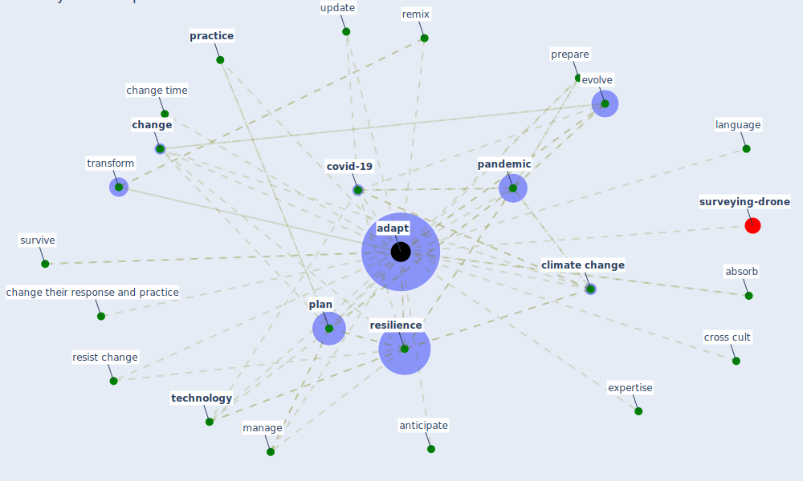

# Keyword: adapt

* [surveying-drone](cluster_13)

## Keywords

 * Cluster_13, absorb, [adapt](keyword_adapt), adapted, adapting, anticipate, [change](keyword_change), change their response and practice, change time, [climate change](keyword_climate_change), [covid-19](keyword_covid-19), cross cult, evolve, expertise, language, manage, [pandemic](keyword_pandemic), [plan](keyword_plan), [practice](keyword_practice), prepare, remix, [resilience](keyword_resilience), resist change, survive, [technology](keyword_technology), transform, update

## Mapping

## Neighbours

### Closest articles

* Guidelines for resilience systems analysis - [LINK](article_oecd_guidelines_2014)
* Strengthening resilience: a priority shared by Health 2020 and - [LINK](article_who_strengthening_2017)
* A review of definitions and measures of system resilience - [LINK](article_hosseini_review_2016)
* Guidelines for Responding to COVID-19 Pandemic: Best Practices, Impacts, and Future Research Directions - [LINK](article_assaad_guidelines_2021)
* Navigating Climate Change: Rethinking the Role of Buildings - [LINK](article_cole_navigating_2020)
* Contributions of Smart City Solutions and Technologies to Resilience against the COVID-19 Pandemic: A Literature Review - [LINK](article_sharifi_contributions_2021)
* <scp>COVID</scp>             ‐19: Small and medium enterprises challenges and responses with creativity, innovation, and entrepreneurship - [LINK](article_thukral_covid19_2021)
* A review of facilities management interventions to mitigate respiratory infections in existing buildings - [LINK](article_zhang_review_2022)
* Should I Stay or Should I Go? Tourists’ COVID-19 Risk Perception and Vacation Behavior Shift - [LINK](article_bratic_should_2021)
* The Impact of COVID-19 on Public Space: A Review of the Emerging Questions - [LINK](article_honey-roses_impact_2020)

### Closest BPs

