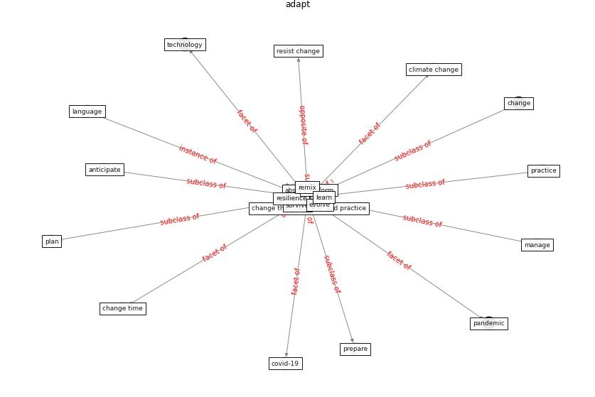

# Keyword: __adapt__
## Clusters

* Cluster 14: [surveying-drone](cluster_14)

## Concepts

 

## Articles
* oecd_guidelines_2014 ([oecd_guidelines_2014](article_oecd_guidelines_2014))
* who_strengthening_2017 ([who_strengthening_2017](article_who_strengthening_2017))
* Guidelines for Responding to COVID-19 Pandemic:
Best Practices, Impacts, and Future Research
Directions ([assaad_guidelines_2021](article_assaad_guidelines_2021))
* Navigating Climate Change: Rethinking the Role of
Buildings ([cole_navigating_2020](article_cole_navigating_2020))
* Contributions of Smart City Solutions and
Technologies to Resilience against the COVID-19
Pandemic: A Literature Review ([sharifi_contributions_2021](article_sharifi_contributions_2021))
* A review of definitions and measures of system
resilience ([hosseini_review_2016](article_hosseini_review_2016))
* COVID19: Small and medium enterprises challenges and
responses with creativity, innovation, and
entrepreneurship ([thukral_covid19_2021](article_thukral_covid19_2021))
* A review of facilities management interventions to
mitigate respiratory infections in existing buildings ([zhang_review_2022](article_zhang_review_2022))
* Towards Resilient Residential Buildings and
Neighborhoods in Light of COVID-19 Pandemic—The
Scenario of Podgorica, Montenegro ([bojovic_towards_2022](article_bojovic_towards_2022))
* WHO-2019-nCoV-Urban_preparedness-2020 ([WHO-2019-nCoV-Urban_preparedness-2020](article_WHO-2019-nCoV-Urban_preparedness-2020))
