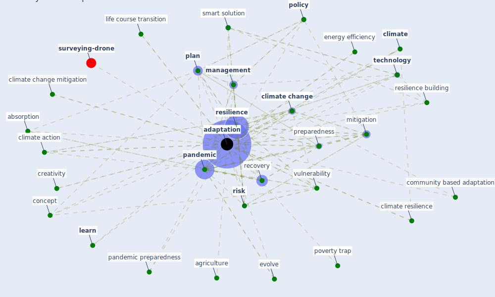

# Keyword: adaptation

* [surveying-drone](cluster_13)

## Keywords

 * Cluster_13, absorption, adaptability, [adaptation](keyword_adaptation), adaptations, adaptive capacity, adverse event, agriculture, agriculture in a change climate, application installation, [build](keyword_build), build green for adaptation, build human resilience, buildinggreen, change time, [climate](keyword_climate), climate action, [climate change](keyword_climate_change), climate change mitigation, climate change world, climate resilience, community based adaptation, community based adaptation to climate change, concept, creativity, [energy efficiency](keyword_energy_efficiency), evolve, evolve over time, habit, health impacts of climate change, [human health](keyword_human_health), [learn](keyword_learn), learn from an adverse event, life course transition, long term, [management](keyword_management), [mitigation](keyword_mitigation), [pandemic](keyword_pandemic), pandemic mitigation, pandemic plan, pandemic preparedness, [plan](keyword_plan), [policy](keyword_policy), poverty trap, preparedness, [recovery](keyword_recovery), regeneration, [resilience](keyword_resilience), resilience building, [risk](keyword_risk), smart solution, [sustainability](keyword_sustainability), sustainable adaptation, sustainable adaptation to the crisis, [technology](keyword_technology), voluntary, [vulnerability](keyword_vulnerability), [workplace](keyword_workplace), flood risk

## Mapping

## Neighbours

### Closest articles

* Addressing vulnerability, building resilience: community-based adaptation to vector-borne diseases in the context of global change - [LINK](article_bardosh_addressing_2017)
* Navigating Climate Change: Rethinking the Role of Buildings - [LINK](article_cole_navigating_2020)
* Contributions of Smart City Solutions and Technologies to Resilience against the COVID-19 Pandemic: A Literature Review - [LINK](article_sharifi_contributions_2021)
* Urban planning after COVID-19 - [LINK](article_rtpi_urban_2021)
* Urban Green Infrastructure and Green Open Spaces: An Issue of Social Fairness in Times of COVID-19 Crisis - [LINK](article_reinwald_urban_2021)
* Revisiting the built environment: 10 potential development changes and paradigm shifts due to COVID-19 - [LINK](article_cheshmehzangi_revisiting_2021)
* The impact of climate change on the epidemiology and control of Rift Valley fever - PubMed - [LINK](article_martin_impact_2008)
* The COVID-19 pandemic: Impacts on cities and major lessons for urban planning, design, and management - [LINK](article_sharifi_covid-19_2020)
* Sustainable work throughout the life course: National policies and strategies, Publications Office of the European Union - [LINK](article_eurofund_sustainable_2016)
* COVID-19 Could Leverage a Sustainable Built Environment - [LINK](article_pinheiro_covid-19_2020)

### Closest BPs

