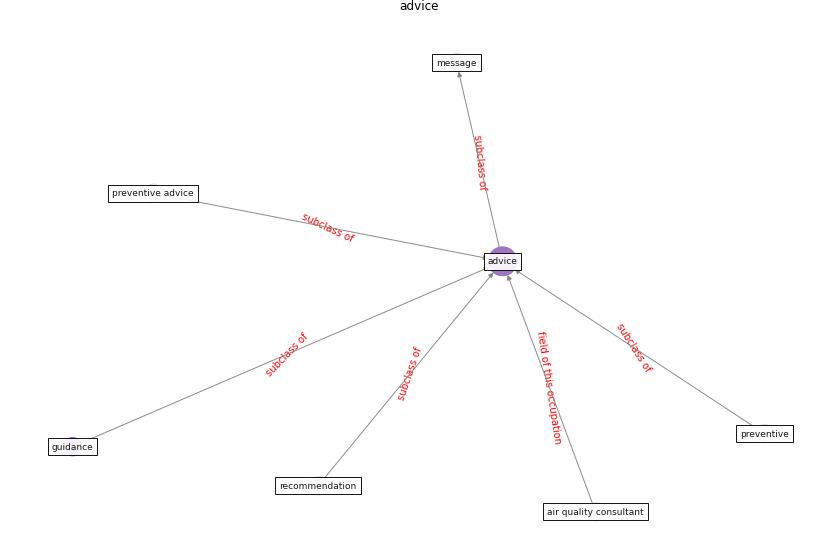

# Keyword: __advice__
## Clusters

* Cluster 6: [building-guidance](cluster_6.md)

## Concepts

 

## Articles
* breeam_covid-19_2020-0 ([breeam_covid-19_2020-0](article_breeam_covid-19_2020-0.md))
* COVID-19 misinformation: Accuracy of articles about
coronavirus prevention mostly shared on social media ([obiala_covid-19_2021](article_obiala_covid-19_2021.md))
* A Mixed Approach on Resilience of Spanish
Dwellings and Households during COVID-19 Lockdown ([cuerdo-vilches_mixed_2020](article_cuerdo-vilches_mixed_2020.md))
* RUDDS_bioRxiv_update-0 ([RUDDS_bioRxiv_update-0](article_RUDDS_bioRxiv_update-0.md))
* realdania_refleksioner_2022_EN-1500 ([realdania_refleksioner_2022_EN-1500](article_realdania_refleksioner_2022_EN-1500.md))
* realdania_refleksioner_2022_EN-150 ([realdania_refleksioner_2022_EN-150](article_realdania_refleksioner_2022_EN-150.md))
* realdania_refleksioner_2022_EN-1450 ([realdania_refleksioner_2022_EN-1450](article_realdania_refleksioner_2022_EN-1450.md))
* realdania_refleksioner_2022_EN-1400 ([realdania_refleksioner_2022_EN-1400](article_realdania_refleksioner_2022_EN-1400.md))
* realdania_refleksioner_2022_EN-1350 ([realdania_refleksioner_2022_EN-1350](article_realdania_refleksioner_2022_EN-1350.md))
* realdania_refleksioner_2022_EN-1300 ([realdania_refleksioner_2022_EN-1300](article_realdania_refleksioner_2022_EN-1300.md))
