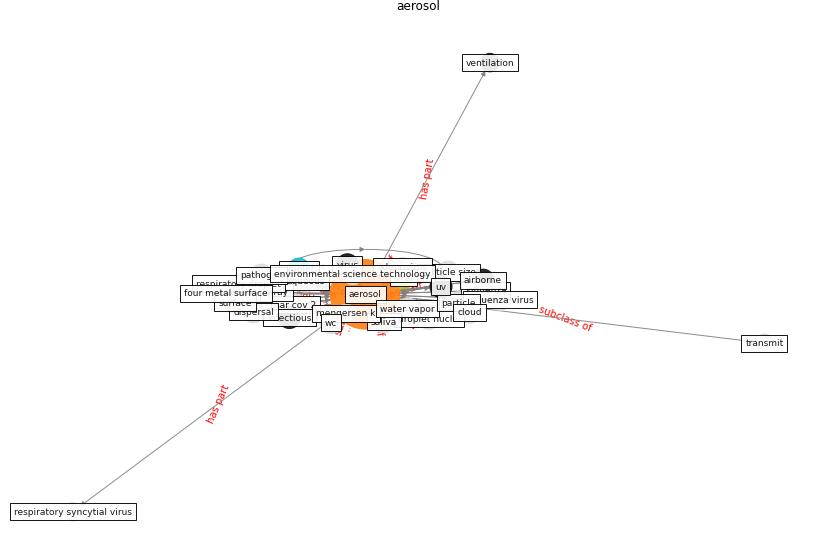

# Keyword: __aerosol__
## Clusters

* Cluster 8: [air-ventilation](cluster_8)

## Concepts

 

## Articles
* A Review on Building Design as a Biomedical
System for Preventing COVID-19 Pandemic ([amran_review_2022](article_amran_review_2022))
* 2019 Novel Coronavirus (COVID-19) Pandemic:
Built Environment Considerations To Reduce
Transmission ([dietz_2019_2020](article_dietz_2019_2020))
* How can airborne transmission of COVID-19 indoors be
minimised? ([morawska_how_2020](article_morawska_how_2020))
* Designing Post COVID-19 Buildings: Approaches for
Achieving Healthy Buildings ([navaratnam_designing_2022](article_navaratnam_designing_2022))
* The ventilation of buildings and other mitigating measures
for COVID-19: a focus on wintertime ([burridge_ventilation_2021](article_burridge_ventilation_2021))
* RESIDENTIAL ARCHITECTURE IN A POST-PANDEMIC
WORLD: IMPLICATIONS OF COVID-19 FOR NEW
CONSTRUCTION AND FOR ADAPTING HERITAGE
BUILDINGS ([spennemann_residential_2021](article_spennemann_residential_2021))
* ashrae_ashrae_2022-100 ([ashrae_ashrae_2022-100](article_ashrae_ashrae_2022-100))
* onway-morris_removal_2021 ([onway-morris_removal_2021](article_onway-morris_removal_2021))
* Upper-room ultraviolet air disinfection might help to
reduce COVID-19 transmission in buildings: a feasibility
study ([beggs_upper-room_2020](article_beggs_upper-room_2020))
* A Global Survey of Infection Control and
Mitigation Measures for Combating the Transmission
of COVID-19 Pandemic in Buildings Under
Facilities Management Services ([sarvari_global_2022](article_sarvari_global_2022))
