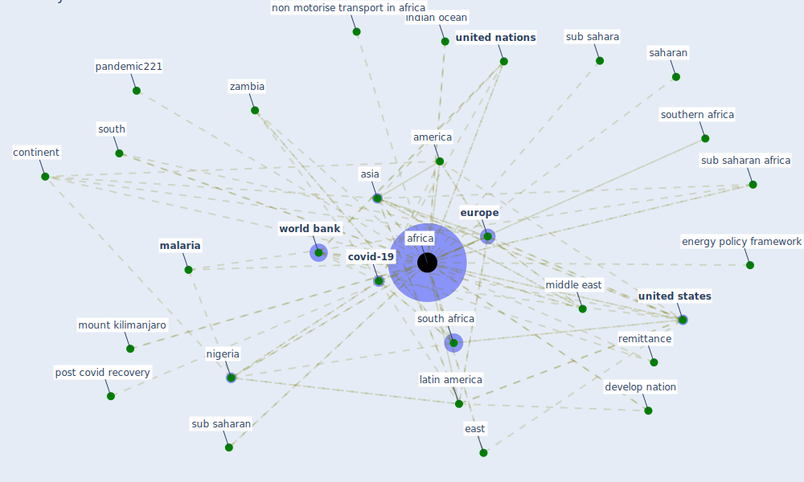

# Keyword: africa

## Keywords

 * 107 organisation for economic co operation and development, about to suffer the ravage of covid19, about to suffer the ravage of covid19 5, [access](keyword_access), access in africa, [africa](keyword_africa), africa subj saharan, african, african development bank, america, arriola and grossman, asia, benin, central, chile, [city](keyword_city), [climate](keyword_climate), construction industry in sub saharan africa, continent, [covid 19 crisis](keyword_covid_19_crisis), covid 19 in africa, [covid 19 pandemic](keyword_covid_19_pandemic), covid 19 pandemic in africa, covid recovery, [covid-19](keyword_covid-19), [develop nation](keyword_develop_nation), east, energy access, energy access in africa, energy policy framework, enterprise, epidemic malaria, [europe](keyword_europe), food and agriculture organization of the united nations, forthcoming economic crisis, geographical, highlands, horn, [india](keyword_india), indian ocean, [infrastructure](keyword_infrastructure), kilimanjaro, latin america, [malaria](keyword_malaria), malawi, mediterranean, middle east, mount kilimanjaro, [namibia](keyword_namibia), [nigeria](keyword_nigeria), nigeria access bank, non motorise transport in africa, northernamerica, [oecd](keyword_oecd), [pandemic](keyword_pandemic), pandemic on africa, pandemic s long term impact, pandemic221, pastoralists, post covid recovery, protect area, [region](keyword_region), remittance, republic of namibia, rural, saharan, sahel, south, [south africa](keyword_south_africa), south america, south asia, southern africa, sub sahara, sub saharan, sub saharan africa, subsahara, subsaharan, subsaharan africa, [sustainable development goal](keyword_sustainable_development_goal), swaziland, [tanzania](keyword_tanzania), the forthcoming economic crisis, tourism to all of africa, [united kingdom](keyword_united_kingdom), [united nations](keyword_united_nations), [united states](keyword_united_states), urban policy to the rescue, [virus](keyword_virus), who, world, [world bank](keyword_world_bank), zambia, zambia s

## Mapping

## Neighbours

### Closest articles

* World Bank Development Report - [LINK](article_world_bank_world_2022)
* Urban planning after COVID-19 - [LINK](article_rtpi_urban_2021)
* Addressing vulnerability, building resilience: community-based adaptation to vector-borne diseases in the context of global change - [LINK](article_bardosh_addressing_2017)
* Decision Making within the Built Environment as a Strategy for Mitigating the Risk of Malaria and Other Vector-Borne Diseases - [LINK](article_obonyo_decision_2018)
* What has been the impact of the COVID-19 pandemic on immigrants? An update on recent evidence - [LINK](article_oecd_what_2022)
* The impact of climate change on the epidemiology and control of Rift Valley fever - PubMed - [LINK](article_martin_impact_2008)
* Perception of COVID-19 impacts on the construction industry over time - [LINK](article_rokooei_perception_2022)
* COVID-19 risks and systemic gaps in Nigeria: resilience building lessons for pandemic and climate change management - [LINK](article_lawal_covid-19_2022)
* COVID-19 pandemic: the effects and prospects in the construction industry. - [LINK](article_ogunnusi_covid-19_2020)
* Multilevel Analysis of Personal, Non-Medical COVID-19-Related Impact Worldwide - [LINK](article_dye_multilevel_2020)

### Closest BPs

