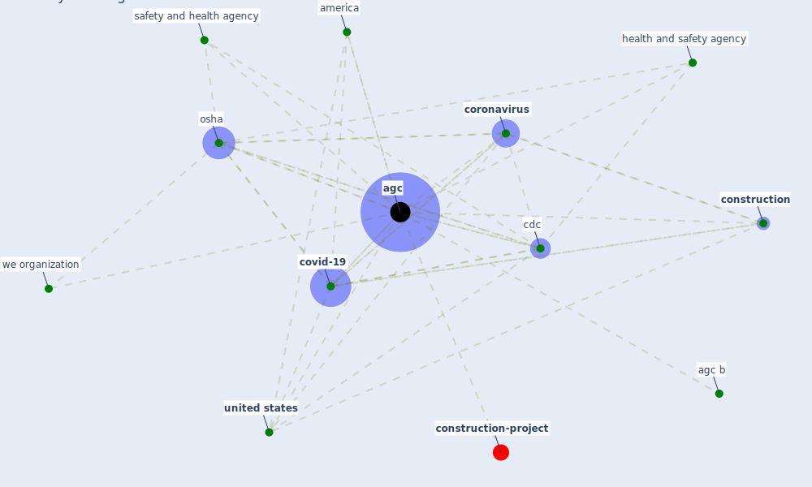

# Keyword: agc

* [construction-project](cluster_8)

## Keywords

 * Cluster_8, [agc](keyword_agc), agc b, america, [cdc](keyword_cdc), [construction](keyword_construction), [coronavirus](keyword_coronavirus), [covid-19](keyword_covid-19), health and safety agency, [osha](keyword_osha), safety and health agency, [united states](keyword_united_states), we organization

## Mapping

## Neighbours

### Closest articles

* Guidelines for Responding to COVID-19 Pandemic: Best Practices, Impacts, and Future Research Directions - [LINK](article_assaad_guidelines_2021)
* Analysis of COVID-19 Concerns Raised by the Construction Workforce and Development of Mitigation Practices - [LINK](article_bou_hatoum_analysis_2021)
* Impacts of COVID-19 on Health and Safety of Workforce in Construction Industry - [LINK](article_pamidimukkala_impacts_2021)
* Influence between COVID-19 Impacts and Project Stakeholders in Chilean Construction Projects - [LINK](article_araya_influence_2021)

### Closest BPs

