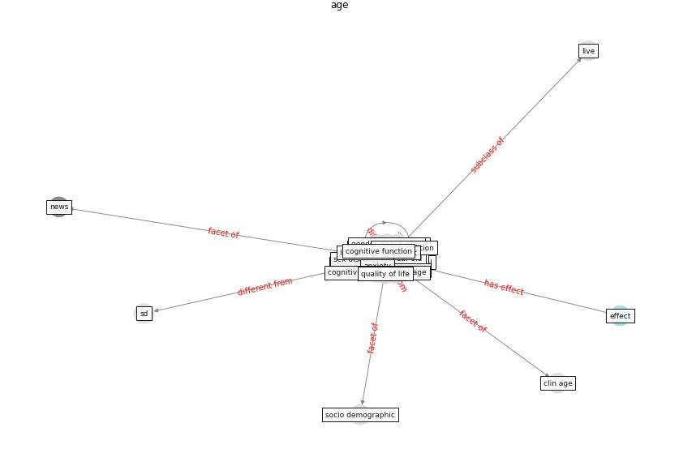

# Keyword: __age__
## Clusters

* Cluster 3: [city-spatial](cluster_3)

## Concepts

 

## Top 10 articles for __age__
* What drives unverified information sharing and
cyberchondria during the COVID-19 pandemic? ([laato_what_2020](article_laato_what_2020))
* The effect of human mobility and control measures on the
COVID-19 epidemic in China ([kraemer_effect_2020](article_kraemer_effect_2020))
* Home garden use during COVID-19: Associations with
physical and mental wellbeing in older adults ([corley_home_2021](article_corley_home_2021))
* Management of the COVID-19 pandemic: challenges,
practices, and organizational support ([hossny_management_2022](article_hossny_management_2022))
* Towards Resilient Residential Buildings and
Neighborhoods in Light of COVID-19 Pandemic—The
Scenario of Podgorica, Montenegro ([bojovic_towards_2022](article_bojovic_towards_2022))
* Exploring the Non-Medical impacts of Covid-19 using
Natural Language Processing ([agade_exploring_2020](article_agade_exploring_2020))
* Psychological Effects of Home Confinement and
Social Distancing Derived from COVID-19 in the
General Population—A Systematic Review ([rodriguez-fernandez_psychological_2021](article_rodriguez-fernandez_psychological_2021))
* The socio-economic determinants of COVID-19: A spatial
analysis of German county level data ([ehlert_socio-economic_2021](article_ehlert_socio-economic_2021))
* Association between indoor-outdoor green features and
psychological health during the COVID-19 lockdown in
Italy: A cross-sectional nationwide study ([spano_association_2021](article_spano_association_2021))
* Role of Information Technology in Covid-19
Prevention ([mehtab_alam_role_2021](article_mehtab_alam_role_2021))
