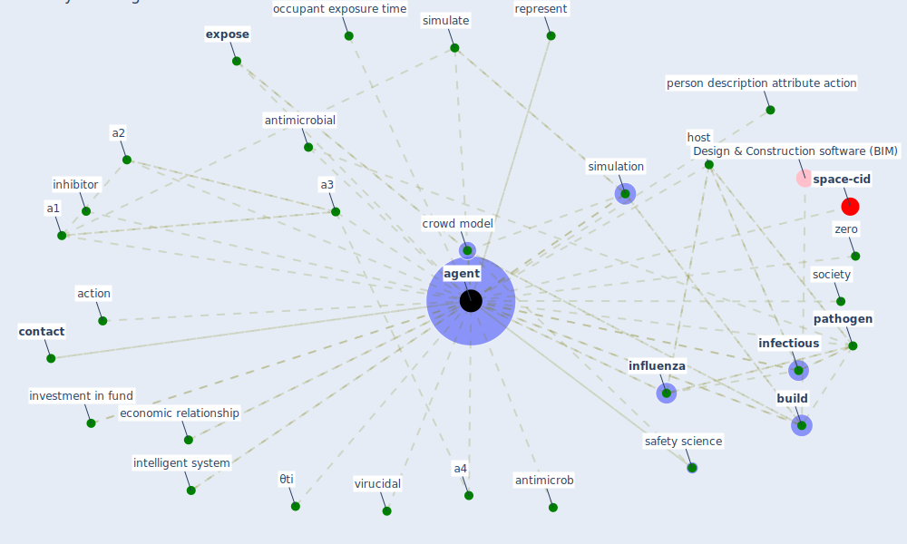

# Keyword: agent

* [space-cid](cluster_2)

## Keywords

 * Cluster_2, a1, a2, a3, a4, a5, action, activity cycle, [agent](keyword_agent), agents, aist rat, anthrax, antimicrob, [antimicrobial](keyword_antimicrobial), attribute, biocidal, bot, [build](keyword_build), carcinogen, [contact](keyword_contact), [control](keyword_control), control measure, [crowd model](keyword_crowd_model), disease transmission, distribution, economic relationship, [expose](keyword_expose), exposure time, host, [infectious](keyword_infectious), [infectious disease](keyword_infectious_disease), [influenza](keyword_influenza), inhibitor, instance, intelligent system, [interaction](keyword_interaction), investment in fund, occupant exposure time, [pathogen](keyword_pathogen), person description attribute action, pseudo random, pseudo random generate, represent, safety science, sar cov, [sar cov 2](keyword_sar_cov_2), simulate, [simulation](keyword_simulation), [society](keyword_society), [state](keyword_state), tq, virucidal, zero, θti

## Mapping

## Neighbours

### Closest articles

* COVID-ABS: An agent-based model of COVID-19 epidemic to simulate health and economic effects of social distancing interventions - [LINK](article_silva_covid-abs_2020)
* EXPOSED: An occupant exposure model for confined spaces to retrofit crowd models during a pandemic - [LINK](article_ronchi_exposed_2020)
* An Overview of Biomedical Ontologies for Pandemics and Infectious Diseases Representation - [LINK](article_bayoudhi_overview_2021)
* Architectural design strategies for infection prevention and control (IPC) in health-care facilities: towards curbing the spread of Covid-19 \textbar SpringerLink - [LINK](article_udomiaye_architectural_2020)
* Designing a Multi-Agent Occupant Simulation System to Support Facility Planning and Analysis for COVID-19 - [LINK](article_lee_designing_2021)
* COVID-19 Could Leverage a Sustainable Built Environment - [LINK](article_pinheiro_covid-19_2020)
* Understanding the role of urban design in disease spreading - [LINK](article_brizuela_understanding_2019)
* A Comprehensive Review of the COVID-19 Pandemic and the Role of IoT, Drones, AI, Blockchain, and 5G in Managing its Impact - [LINK](article_chamola_comprehensive_2020)
* 2019 Novel Coronavirus (COVID-19) Pandemic: Built Environment Considerations To Reduce Transmission - [LINK](article_dietz_2019_2020)
* Covid-19 and asset management in EU: a preliminary assessment of performance and investment styles - [LINK](article_rizvi_covid-19_2020)

### Closest BPs

