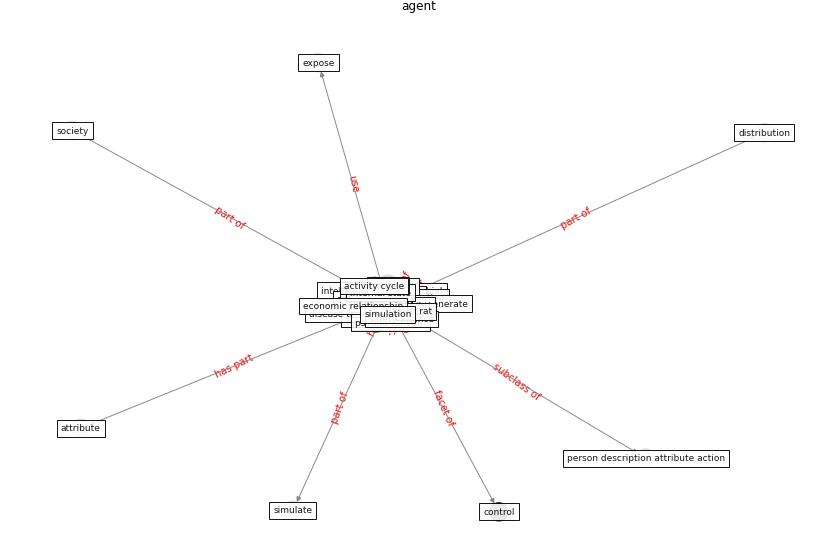

# Keyword: __agent__
## Clusters

* Cluster 6: [simulation-model](cluster_6)

## Concepts

 

## Top 10 articles for __agent__
* COVID-ABS: An agent-based model of COVID-19
epidemic to simulate health and economic effects of social
distancing interventions ([silva_covid-abs_2020](article_silva_covid-abs_2020))
* EXPOSED: An occupant exposure model for confined
spaces to retrofit crowd models during a pandemic ([ronchi_exposed_2020](article_ronchi_exposed_2020))
* An Overview of Biomedical Ontologies for Pandemics
and Infectious Diseases Representation ([bayoudhi_overview_2021](article_bayoudhi_overview_2021))
* Designing a Multi-Agent Occupant Simulation
System to Support Facility Planning and Analysis
for COVID-19 ([lee_designing_2021](article_lee_designing_2021))
* COVID-19 Could Leverage a Sustainable Built
Environment ([pinheiro_covid-19_2020](article_pinheiro_covid-19_2020))
* udomiaye_architectural_2020 ([udomiaye_architectural_2020](article_udomiaye_architectural_2020))
* p15-lee-vor ([p15-lee-vor](article_p15-lee-vor))
* RUDDS_bioRxiv_update ([RUDDS_bioRxiv_update](article_RUDDS_bioRxiv_update))
* 2019 Novel Coronavirus (COVID-19) Pandemic:
Built Environment Considerations To Reduce
Transmission ([dietz_2019_2020](article_dietz_2019_2020))
* A Comprehensive Review of the COVID-19 Pandemic
and the Role of IoT, Drones, AI, Blockchain, and
5G in Managing its Impact ([chamola_comprehensive_2020](article_chamola_comprehensive_2020))
