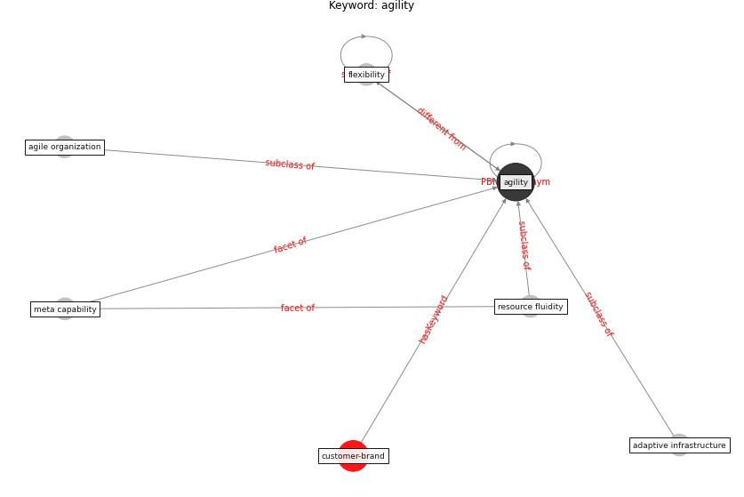

# Keyword: agility

* [customer-brand](cluster_Cluster_8)

## Keywords

 * Cluster_8, adaptive infrastructure, agile organization, [agility](keyword_agility), flexibility, meta capability, resource fluidity

## Concepts

 

## Neighbours

### Closest articles

* COVID-19 as a Harbinger of Transforming Infrastructure Resilience - [LINK](article_carvalhaes_covid-19_2020)
* How COVID-19 Could Accelerate the Adoption of New Retail Technologies and Enhance the (E-)Servicescape - [LINK](article_willems_how_2021)

### Closest BPs

