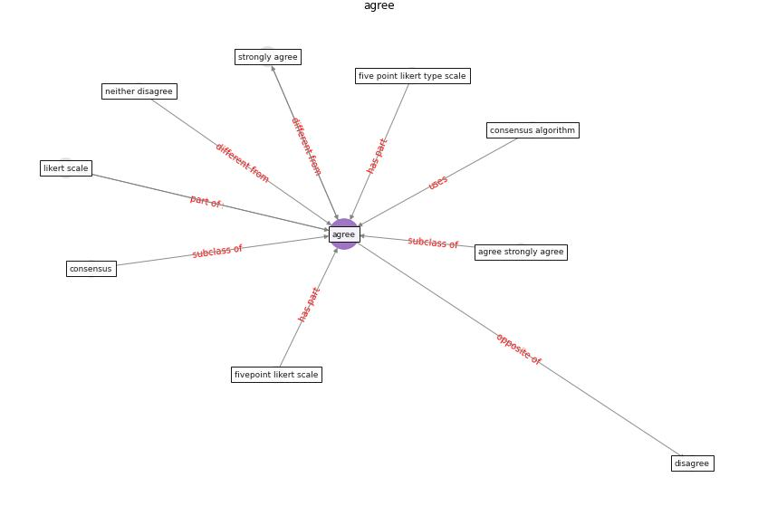

# Keyword: __agree__
## Clusters

* Cluster 6: [building-guidance](cluster_6.md)

## Concepts

 

## Articles
* COVID-19 media fatigue: predictors of decreasing
interest and avoidance of COVID-19–related news ([buneviciene_covid-19_2021](article_buneviciene_covid-19_2021.md))
* The Effects of Pandemic on Construction Industry
in the UK ([shibani_effects_2020](article_shibani_effects_2020.md))
* The Effects of Pandemic on Construction Industry
in the UK ([shibani_effects_2020](article_shibani_effects_2020.md))
* The Effects of Pandemic on Construction Industry
in the UK ([shibani_effects_2020](article_shibani_effects_2020.md))
* Health Information Exchange with Blockchain amid
Covid-19-like Pandemics ([christodoulou_health_2020](article_christodoulou_health_2020.md))
* Should I Stay or Should I Go? Tourists’
COVID-19 Risk Perception and Vacation Behavior
Shift ([bratic_should_2021](article_bratic_should_2021.md))
* Mental health economics: A prospective study on
psychological flourishing and associations with healthcare
costs and sickness benefit transfers in Denmark ([santini_mental_2021](article_santini_mental_2021.md))
* The impacts of knowledge, risk perception, emotion and
information on citizens’ protective behaviors during the
outbreak of COVID-19: a cross-sectional study in
China ([ning_impacts_2020](article_ning_impacts_2020.md))
* RUDDS_bioRxiv_update-0 ([RUDDS_bioRxiv_update-0](article_RUDDS_bioRxiv_update-0.md))
* realdania_refleksioner_2022_EN-150 ([realdania_refleksioner_2022_EN-150](article_realdania_refleksioner_2022_EN-150.md))
