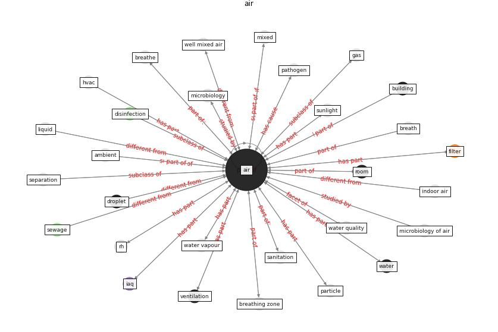

# Keyword: air

* [building-space](cluster_Cluster_2)

* [air-uv](cluster_Cluster_9)

* [ward-patient](cluster_Cluster_15)

## Keywords

 * [aerosol](keyword_aerosol), [air](keyword_air), air clean, [air filter](keyword_air_filter), air handling unit, air leakage, air outlet, air qual aerosol air qual, air quality, airflow, ambient, ase100, auxiliary ventilation system, [bioaerosol](keyword_bioaerosol), biophysical, breath, breathe, breathing zone, [build](keyword_build), [building](keyword_building), carbon dioxide, circu lation, circulation, cloud, co2, convection, [disinfection](keyword_disinfection), [droplet](keyword_droplet), ductwork, exhaust outlet, extract, fan, [filter](keyword_filter), filtration, fresh air, gas, ground level, heat transfer medium, humidifier, [hvac](keyword_hvac), [iaq](keyword_iaq), [icu](keyword_icu), indoor air, [indoor air quality](keyword_indoor_air_quality), microbiology, mixed, natural ventilation, [nature](keyword_nature), [noise](keyword_noise), noise pollution, outdoor, outdoor air, outlet, outlet sample, oxygen, [particle](keyword_particle), particulate matter, [pathogen](keyword_pathogen), [pollutant](keyword_pollutant), pollution, pressurize, radiation, recirculate, respir, [respiratory](keyword_respiratory), respiratory system, rh, [room](keyword_room), sanitation, [sar cov 2](keyword_sar_cov_2), separation, [sewage](keyword_sewage), significant, solid, solution, stagnant air, sunlight, [surface](keyword_surface), surface pollution, surface sample, [temperature](keyword_temperature), thermal plume, tracer concentration, transmit, transportation, [travel](keyword_travel), ventilate, [ventilation](keyword_ventilation), [ventilation system](keyword_ventilation_system), visual, waste management, [water](keyword_water), water pollution, water quality, water vapour, well mixed air, [window](keyword_window), [winter](keyword_winter), filter, filtration

## Concepts

 

## Neighbours

### Closest articles

* A critical review of heating, ventilation, and air conditioning (HVAC) systems within the context of a global SARS-CoV-2 epidemic - [LINK](article_elsaid_critical_2021)
* The ventilation of buildings and other mitigating measures for COVID-19: a focus on wintertime - [LINK](article_burridge_ventilation_2021)
* Toilets dominate environmental detection of SARS-CoV-2 virus in a hospital - [LINK](article_ding_toilets_2020)
* Review and comparison of HVAC operation guidelines in different countries during the COVID-19 pandemic - [LINK](article_guo_review_2021)
* Methods for air cleaning and protection of building occupants from airborne pathogens - [LINK](article_bolashikov_methods_2009)
* Upper-room ultraviolet air disinfection might help to reduce COVID-19 transmission in buildings: a feasibility study - [LINK](article_beggs_upper-room_2020)
* Characterization and performance evaluation of a full-scale activated carbon-based dynamic botanical air filtration system for improving indoor air quality - [LINK](article_wang_characterization_2011)
* Environmental factors involved in SARS-CoV-2 transmission: effect and role of indoor environmental quality in the strategy for COVID-19 infection control - [LINK](article_azuma_environmental_2020)
* Readiness Assessment of Green Building Certification Systems for Residential Buildings during Pandemics - [LINK](article_tleuken_readiness_2021)

### Closest BPs

