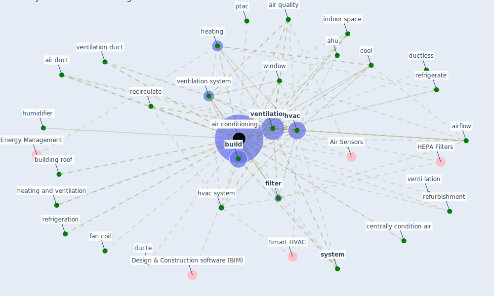

# Keyword: air conditioning

## Keywords

 * Air Sensors, ahu, air condi tione, air condition, [air conditioning](keyword_air_conditioning), air duct, [air filter](keyword_air_filter), air flow, air purifier, air quality, air volume, air filter, airflow, airflow generate, all air, all air system, alternative space arrangement, association of refrigeration, azuma, [build](keyword_build), building roof, central, centralize, centrally condition air, chill, chill beam, chill water, [china](keyword_china), chinese association of refrigeration, circulation, circulation of fresh air, cool, cool warming, covid 19 superspreade, covid19 outbreak, covid19 pandemic, cross flow, different type, duct layout, ducte, ductless, equipment, fan, fan coil, [filter](keyword_filter), function, heating, heating and ventilation, heating ventilation and air conditioning, humidifier, [hvac](keyword_hvac), [hvac system](keyword_hvac_system), [indoor climate](keyword_indoor_climate), [indoor environment](keyword_indoor_environment), indoor space, indoor temperature, ion, mixed mode system, negative pressure ventilation, outdoor air, outside air, ptac, recirculate, recirculate air, recirculation, recycle air, refrigerate, refrigeration, refurbishment, repatriate, reticulation, reticulation of the air, [roof](keyword_roof), room temperature control, run time, [sar cov 2](keyword_sar_cov_2), sars mers covid 19, space arrangement, split, split air conditioning unit, split system, sterilize, sterilize the air, [system](keyword_system), temperature control, [thermostat](keyword_thermostat), thermostat set, [transmission](keyword_transmission), [uv](keyword_uv), vatican state, vatican state child s hospital, venti lation, [ventilation](keyword_ventilation), ventilation duct, ventilation system, ventilation ventilator, [ventilator](keyword_ventilator), watercoole, [window](keyword_window), wireless sensor

## Mapping

## Neighbours

### Closest articles

* A critical review of heating, ventilation, and air conditioning (HVAC) systems within the context of a global SARS-CoV-2 epidemic - [LINK](article_elsaid_critical_2021)
* Review and comparison of HVAC operation guidelines in different countries during the COVID-19 pandemic - [LINK](article_guo_review_2021)
* Environmental factors involved in SARS-CoV-2 transmission: effect and role of indoor environmental quality in the strategy for COVID-19 infection control - [LINK](article_azuma_environmental_2020)
* COVID-19 Experience Transforming the Protective Environment of Office Buildings and Spaces - [LINK](article_phapant_covid-19_2021)
* The effect of a redesigned floor plan, occupant density and the quality of indoor climate on the cost of space, productivity and sick leave in an office building–A case study - [LINK](article_saari_effect_2006)
* Heating, ventilation and air-conditioning systems in the context of COVID-19 - [LINK](article_ecdc_heating_2020)
* Toilets dominate environmental detection of SARS-CoV-2 virus in a hospital - [LINK](article_ding_toilets_2020)
* Continuous IEQ monitoring system: Context and development - [LINK](article_parkinson_continuous_2019)
* Readiness Assessment of Green Building Certification Systems for Residential Buildings during Pandemics - [LINK](article_tleuken_readiness_2021)
* Health, Wellbeing \& Productivity in Offices - [LINK](article_world_green_building_council_health_2014)

### Closest BPs

