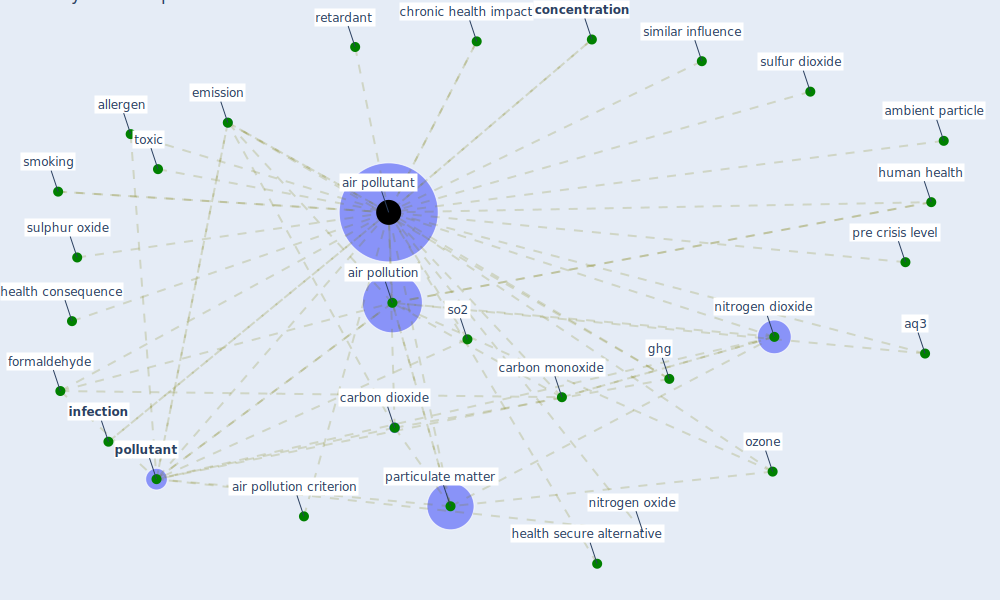

# Keyword: air pollutant

## Keywords

 * [air pollutant](keyword_air_pollutant), air pollutants, [air pollution](keyword_air_pollution), air pollution criterion, allergen, ambient particle, aq3, aq3 indicator, carbon dioxide, carbon monoxide, chronic health impact, clude, co2, co2 control, [concentration](keyword_concentration), emission, fine air particle, [formaldehyde](keyword_formaldehyde), ghg, health consequence, health impact, health secure alternative, [human health](keyword_human_health), indoor air, indoor air level, [infection](keyword_infection), nitrogen dioxide, nitrogen oxide, no2, o3, other study, ozone, particulate matter, pollen allergy, [pollutant](keyword_pollutant), pre crisis level, retardant, similar influence, smoking, so2, sulfur dioxide, sulphur oxide, toxic, [united kingdom](keyword_united_kingdom)

## Mapping

## Neighbours

### Closest articles

* COVID-19 Higher Mortality in Chinese Regions With Chronic Exposure to Lower Air Quality - [LINK](article_pansini_covid-19_2021)
* Making green infrastructure healthier infrastructure - [LINK](article_lohmus_making_2015)
* Readiness Assessment of Green Building Certification Systems for Residential Buildings during Pandemics - [LINK](article_tleuken_readiness_2021)
* Urban planning after COVID-19 - [LINK](article_rtpi_urban_2021)
* A Review on Building Design as a Biomedical System for Preventing COVID-19 Pandemic - [LINK](article_amran_review_2022)
* An Intelligent IEQ Monitoring and Feedback System: Development and Applications - [LINK](article_geng_intelligent_2021)
* Indoor Air Quality: Rethinking rules of building design strategies in post-pandemic architecture - [LINK](article_megahed_indoor_2021)
* Coronavirus and Climate Change - [LINK](article_harvard_th_chan_schoold_of_public_health_coronavirus_2020)
* Learning from pandemics: Applying resilience thinking to identify priorities for planning urban settlements - [LINK](article_syal_learning_2021)
* Nurture to nature via COVID-19, a self-regenerating environmental strategy of environment in global context - [LINK](article_paital_nurture_2020)

### Closest BPs

