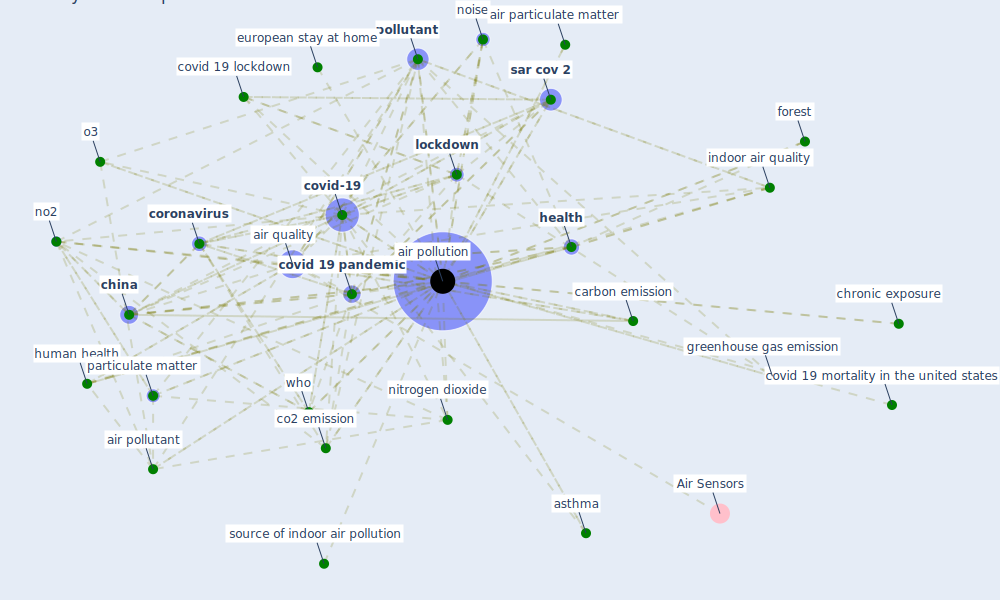

# Keyword: air pollution

## Keywords

 * 34 contini d costabile f, air humidity, air particulate matter, air pollut, [air pollutant](keyword_air_pollutant), [air pollution](keyword_air_pollution), air quality, airpollution, ambient, ambient air pollution, ambient air pollution level, ambient outdoor air pollution, aq3, asian city, asthma, asthmatic, atmospheric, atmospheric pollution, bherwani h, [biodiversity loss](keyword_biodiversity_loss), biomass cookingfuel related household, carbon emission, carbon monoxide, carcinogen, cardiovascular illness and death, [change](keyword_change), [china](keyword_china), chronic exposure, co2, co2 emission, [coronavirus](keyword_coronavirus), covid 19 and air pollution, [covid 19 crisis](keyword_covid_19_crisis), covid 19 lockdown, covid 19 mortality in the united states, covid 19 outbreak, [covid 19 pandemic](keyword_covid_19_pandemic), [covid-19](keyword_covid-19), different level, dilution, double hit hypothesis, drag on economic growth, ecologic, emission, europe s city, european stay at home, flood, [forest](keyword_forest), greenhouse gas emission, ground station, [health](keyword_health), [human health](keyword_human_health), [india](keyword_india), [indoor air quality](keyword_indoor_air_quality), [lockdown](keyword_lockdown), lung cancer, new eu research, nitrogen dioxide, no2, [noise](keyword_noise), noise level, o3, ozone, particulate matter, pm 10, pm2, [pollutant](keyword_pollutant), pollute, polluted air, polluted place and city, [pollution](keyword_pollution), prematurely, probability of die, [public health](keyword_public_health), [reduce](keyword_reduce), [respiratory](keyword_respiratory), respiratory disease, respiratory health, respiratory infection, restriction take effect, risk factor, [sar cov 2](keyword_sar_cov_2), sar cov 2 infection, socio environmental, source of indoor air pollution, [temperature](keyword_temperature), traffic, traffic emission, transboundaryhealth, transboundaryhealth impact, tree canopy, [united states](keyword_united_states), urban heat island, urban ventilation, urbanforest, villanyi, who, wind speed, [wuhan](keyword_wuhan), fight

## Mapping

## Neighbours

### Closest articles

* COVID-19 Higher Mortality in Chinese Regions With Chronic Exposure to Lower Air Quality - [LINK](article_pansini_covid-19_2021)
* A critical review of heating, ventilation, and air conditioning (HVAC) systems within the context of a global SARS-CoV-2 epidemic - [LINK](article_elsaid_critical_2021)
* Coronavirus and Climate Change - [LINK](article_harvard_th_chan_schoold_of_public_health_coronavirus_2020)
* The COVID-19 pandemic: Impacts on cities and major lessons for urban planning, design, and management - [LINK](article_sharifi_covid-19_2020)
* Green spaces, especially forest, linked to lower SARS-CoV-2 infection rates: A one-year nationwide study - [LINK](article_jiang_green_2021)
* An environmental and health perspective for COVID-19 outbreak: Meteorology and air quality influence, sewage epidemiology indicator, hospitals disinfection, drug therapies and recommendations - [LINK](article_barcelo_environmental_2020)
* Nurture to nature via COVID-19, a self-regenerating environmental strategy of environment in global context - [LINK](article_paital_nurture_2020)
* Indoor Air Quality: Rethinking rules of building design strategies in post-pandemic architecture - [LINK](article_megahed_indoor_2021)
* Covid-19 and the politics of sustainable energy transitions - [LINK](article_kuzemko_covid-19_2020)
* A critical analysis of the impacts of COVID-19 on the global economy and ecosystems and opportunities for circular economy strategies - [LINK](article_ibn-mohammed_critical_2021)

### Closest BPs

