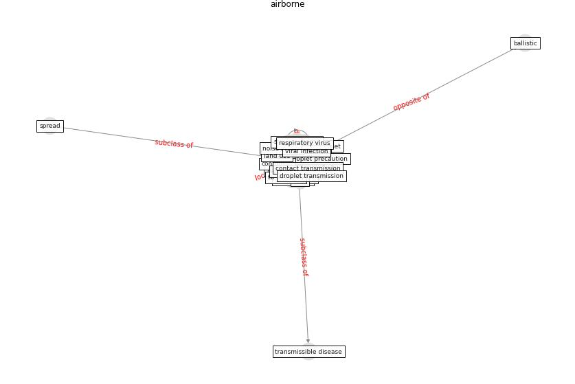

# Keyword: __airborne__
## Clusters

* Cluster 2: [air-sars](cluster_2)
* Cluster 11: [uvgi-uv](cluster_11)

## Concepts

 

## Articles
* ashrae_ashrae_2022 ([ashrae_ashrae_2022](article_ashrae_ashrae_2022))
* Environmental factors involved in SARS-CoV-2
transmission: effect and role of indoor environmental
quality in the strategy for COVID-19 infection control ([azuma_environmental_2020](article_azuma_environmental_2020))
* Methods for air cleaning and protection of building
occupants from airborne pathogens ([bolashikov_methods_2009](article_bolashikov_methods_2009))
* How can airborne transmission of COVID-19 indoors be
minimised? ([morawska_how_2020](article_morawska_how_2020))
* A Review on Building Design as a Biomedical
System for Preventing COVID-19 Pandemic ([amran_review_2022](article_amran_review_2022))
* The ventilation of buildings and other mitigating measures
for COVID-19: a focus on wintertime ([burridge_ventilation_2021](article_burridge_ventilation_2021))
* Applications of ultraviolet germicidal irradiation
disinfection in health care facilities: Effective
adjunct, but not stand-alone technology ([memarzadeh_applications_2010](article_memarzadeh_applications_2010))
* Upper-Room Ultraviolet Light and Negative Air
Ionization to Prevent Tuberculosis Transmission ([escombe_upper-room_2009](article_escombe_upper-room_2009))
* Air Disinfection for Airborne Infection Control
with a Focus on COVID-19: Why Germicidal UV is
Essential† ([nardell_air_2021](article_nardell_air_2021))
* Indoor Air Quality: Rethinking rules of building
design strategies in post-pandemic architecture ([megahed_indoor_2021](article_megahed_indoor_2021))
