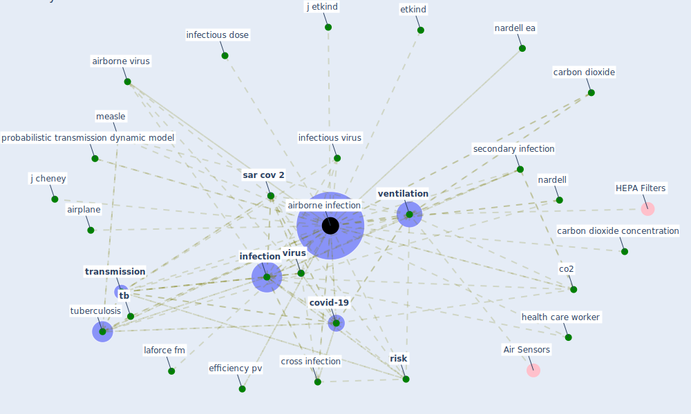

# Keyword: airborne infection

## Keywords

 * [airborne infection](keyword_airborne_infection), airborne infections, airborne virus, airplane, carbon dioxide, carbon dioxide concentration, co2, cough aerosol, [covid-19](keyword_covid-19), cross infection, [disinfection](keyword_disinfection), droplet nuclei, efficiency pv, etkind, health care worker, [infection](keyword_infection), infectious dose, infectious virus, j cheney, j etkind, laforce fm, measle, nardell, nardell ea, probabilistic transmission dynamic model, [risk](keyword_risk), [sar cov 2](keyword_sar_cov_2), secondary infection, [tb](keyword_tb), [transmission](keyword_transmission), [tuberculosis](keyword_tuberculosis), [ventilation](keyword_ventilation), ventilation arrangement, [virus](keyword_virus)

## Mapping

## Neighbours

### Closest articles

* Air Disinfection for Airborne Infection Control with a Focus on COVID‐19: Why Germicidal UV is Essential             † - [LINK](article_nardell_air_2021)
* The ventilation of buildings and other mitigating measures for COVID-19: a focus on wintertime - [LINK](article_burridge_ventilation_2021)
* Upper-Room Ultraviolet Light and Negative Air Ionization to Prevent Tuberculosis Transmission - [LINK](article_escombe_upper-room_2009)
* Methods for air cleaning and protection of building occupants from airborne pathogens - [LINK](article_bolashikov_methods_2009)
* Environmental factors involved in SARS-CoV-2 transmission: effect and role of indoor environmental quality in the strategy for COVID-19 infection control - [LINK](article_azuma_environmental_2020)
* How can airborne transmission of COVID-19 indoors be minimised? - [LINK](article_morawska_how_2020)
* The effect of occupant distribution on energy consumption and COVID-19 infection in buildings: A case study of university building - [LINK](article_mokhtari_effect_2021)
* Architectural design strategies for infection prevention and control (IPC) in health-care facilities: towards curbing the spread of Covid-19 \textbar SpringerLink - [LINK](article_udomiaye_architectural_2020)
* A review of facilities management interventions to mitigate respiratory infections in existing buildings - [LINK](article_zhang_review_2022)
* Designing Post COVID-19 Buildings: Approaches for Achieving Healthy Buildings - [LINK](article_navaratnam_designing_2022)

### Closest BPs

