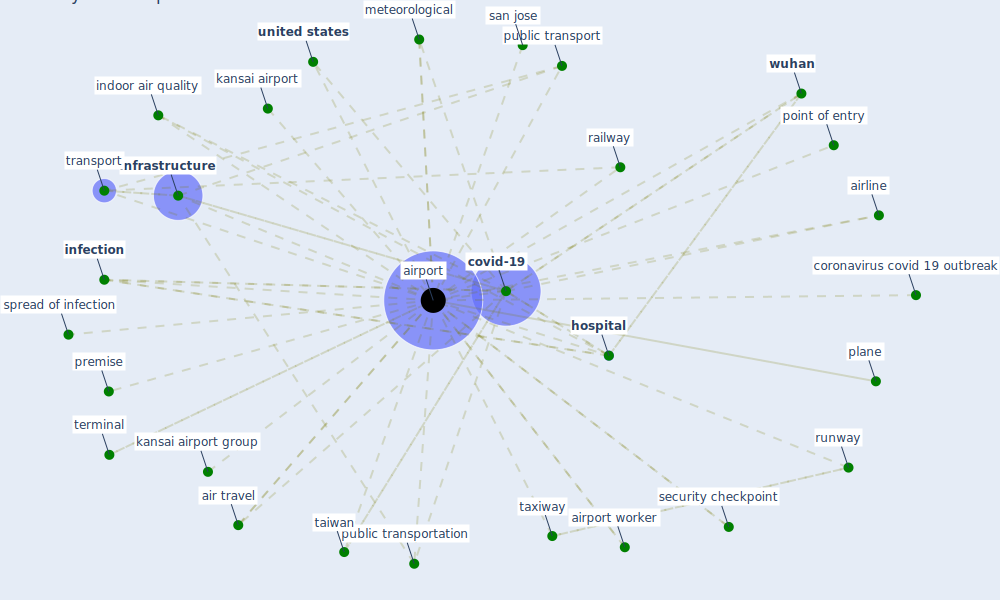

# Keyword: airport

## Keywords

 * air quality, air travel, airline, [airport](keyword_airport), airport worker, airports, coronavirus covid 19 outbreak, [covid-19](keyword_covid-19), [hospital](keyword_hospital), [indoor air quality](keyword_indoor_air_quality), [infection](keyword_infection), [infrastructure](keyword_infrastructure), [kansai airport](keyword_kansai_airport), kansai airport group, meteorological, plane, point of entry, premise, [public transport](keyword_public_transport), public transportation, railway, runway, san jose, security checkpoint, spread of infection, [taiwan](keyword_taiwan), taxiway, terminal, [transport](keyword_transport), [united states](keyword_united_states), [vinci airports](keyword_vinci_airports), [wuhan](keyword_wuhan)

## Mapping

## Neighbours

### Closest articles

* COVID-19 and a new resilient infrastructure landscape - [LINK](article_oecd_covid-19_2021)
* KIX to apply antimicrobial coating in its fight against COVID-19 - [LINK](article_kansai_airport_kix_2021)
* Respiratory pandemics, urban planning and design: A multidisciplinary rapid review of the literature - [LINK](article_harris_respiratory_2022)
* On the Coronavirus (COVID-19) Outbreak and the Smart City Network: Universal Data Sharing Standards Coupled with Artificial Intelligence (AI) to Benefit Urban Health Monitoring and Management - [LINK](article_allam_coronavirus_2020)
* A critical analysis of the impacts of COVID-19 on the global economy and ecosystems and opportunities for circular economy strategies - [LINK](article_ibn-mohammed_critical_2021)
* The Effect of Opening Windows on Air Change Rates in Two Homes - [LINK](article_howard-reed_effect_2002)
* COVID-19: Risk assessment and mitigation measures in healthcare and non-healthcare workplaces - [LINK](article_fawzy_covid-19_2021)
* A review of definitions and measures of system resilience - [LINK](article_hosseini_review_2016)
* Design COVID-19 Ontology: A Healthcare and Safety Perspective - [LINK](article_aloulou_design_2022)
* How the 5G Enabled the COVID-19 Pandemic Prevention and Control: Materiality, Affordance, and (De-)Spatialization - [LINK](article_li_how_2022)

### Closest BPs

