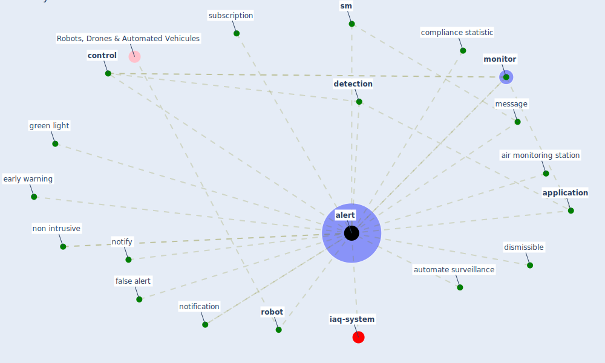

# Keyword: alert

* [iaq-system](cluster_3)

## Keywords

 * Cluster_3, air monitoring station, [alert](keyword_alert), alerting, alerts, [application](keyword_application), automate surveillance, compliance statistic, [control](keyword_control), [detection](keyword_detection), dismissible, early warning, false alert, green light, message, [monitor](keyword_monitor), non intrusive, notification, notify, [robot](keyword_robot), [sm](keyword_sm), subscription

## Mapping

## Neighbours

### Closest articles

* Mobile Technology Solution for COVID-19: Surveillance and Prevention - [LINK](article_raza_mobile_2021)
* A Comprehensive Review of the COVID-19 Pandemic and the Role of IoT, Drones, AI, Blockchain, and 5G in Managing its Impact - [LINK](article_chamola_comprehensive_2020)
* A comprehensive review on indoor air quality monitoring systems for enhanced public health - [LINK](article_saini_comprehensive_2020)
* Towards the sustainable development of smart cities through mass video surveillance: A response to the COVID-19 pandemic - [LINK](article_shorfuzzaman_towards_2021)
* Designing Post COVID-19 Buildings: Approaches for Achieving Healthy Buildings - [LINK](article_navaratnam_designing_2022)
* Impact of COVID-19 on IoT Adoption in Healthcare, Smart Homes, Smart Buildings, Smart Cities, Transportation and Industrial IoT - [LINK](article_umair_impact_2021)
* The Smart City and Covid‐19 - [LINK](article_webb_smart_2020)
* Learning from the COVID-19 pandemic in governing smart cities - [LINK](article_bolivar_learning_2022)
* Continuous IEQ monitoring system: Context and development - [LINK](article_parkinson_continuous_2019)

### Closest BPs

